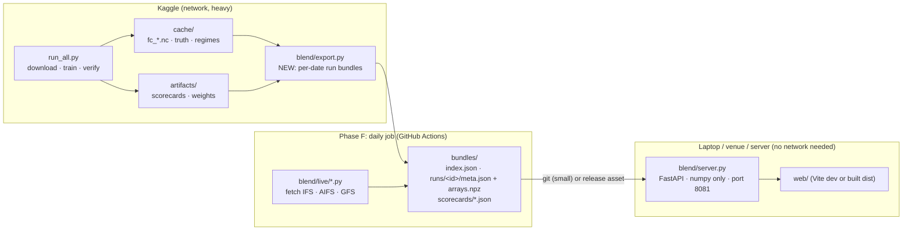

# PS26081 — Backend Build Plan

**Audience:** the coding agent that will build the backend (written for Claude Sonnet 5.5), and the humans reviewing it.
**Owner:** Shreyash (app). The blending model in `blend/` is co-owned with Mridul; see the ground rules in §3.
**Written:** 29 Sep 2026, against commit `efd563a` on `main`.

The backend connects the trained blending model (`blend/`, `run_all.py`) to the web dashboard (`web/`). Today the dashboard
runs on invented numbers from `web/src/lib/synthetic.ts`. When this plan is done, it shows **real WeatherBench 2 forecasts,
real weights and real held-out scores**, served by `blend/server.py`. The bottom bar then reads "ENGINE CONNECTED" instead
of "SYNTHETIC DATA".

---

## 0. How to use this document

1. Read §1–§5 once, fully, before writing any code. They define the facts every task depends on.
2. Do the tasks in §6 **in order**. Each task lists the files to create or change, the exact functions, the steps and an
   **acceptance check**. Do not start a task until the previous task's check passes.
3. After every task: run the test command in §7, then commit (one commit per task, message style in §3.6).
4. When something in this plan conflicts with the code on disk, **the code wins**. Stop and note it in the "Deviations"
   section at the end of this file, with the reason, before continuing.
5. Never invent a number, a variable name, a file path or an API field. If you need one this plan does not give, look it
   up in the code (paths are given) or stop and ask.

---

## 1. What exists today

### 1.1 The model (`blend/`, Python)

| File | What it does | Key names you will call |
|---|---|---|
| `blend/config.py` | Frozen scope: stores, India box, leads, variables, model sets S1–S4, seasons, regimes, hyperparameters | `C.VARS`, `C.SETS`, `C.SEASON_OF_MONTH`, `C.REGIMES`, `C.RAIN`, `C.T2M`, `C.WIND`, `C.MSLP`, `C.K_SHRINK`, `C.ALPHA` |
| `blend/sources.py` | Downloads WB2 forecasts / ERA5 truth (network) | not used by the server |
| `blend/cache.py` | Local NetCDF cache: `fc_{model}_{year}.nc`, `truth_era5.nc` | `load_forecasts(cache, models, years)`, `load_truth(cache)`, `fc_path`, `truth_path` |
| `blend/harmonise.py` | Units (rain m→mm), stacking models, truth at valid time, common mask, season and regime coords | `prepare(forecasts, truth, var, labels) -> (fc, obs)` with dims `(model, init, lead, latitude, longitude)` and `(init, lead, latitude, longitude)` |
| `blend/regimes.py` | Regime indices from ERA5 and labels per date | `label(indices_df, clim_years) -> DataFrame[regime, season, z_*]`, `regime_keys(dates, labels)`, `all_keys()` |
| `blend/skill.py` | Bias and MSE tables, shrinkage, smoothing | `fit_bias`, `apply_bias`, `fit_mse(fc_bc, obs, level, k, size, keys)` |
| `blend/weights.py` | Inverse-MSE weights, blend | `inverse_mse(mse, alpha)`, `blend(fc_bc, w)` |
| `blend/verify.py` | Folds, rungs B0…B3, bootstrap, scorecard | `make_folds(init, mode)`, `fit(fc, obs) -> p`, `predict(fc, p)`, `run_folds`, `scorecard`, `block_bootstrap`, `domain_se`, `BLENDS` |
| `blend/products.py` | PNG figures | not used by the server |
| `run_all.py` | One command on Kaggle: download → train → verify → write `artifacts/` | `download(...)`, `train(...)`, `regimes_path(cache)` |

`run_all.py` writes to `<out>/cache/` (inputs) and `<out>/artifacts/` (outputs):

```
cache/fc_{model}_{year}.nc        (init, lead=1..10, latitude, longitude) per model-year, WB2 names, rain in metres
cache/truth_era5.nc               (time, latitude, longitude), 00 UTC
cache/regime_indices.csv          date, cmz_rain, nw_rain, heat_t2m, bay_mslp_min
artifacts/scorecard_{SET}.csv     set, var, lead_day, rung, rmse, n_days, d_vs_B0, lo_vs_B0, hi_vs_B0, pct_vs_B0,
                                  verdict_vs_B0, (same for B0bc)
artifacts/scorecard_by_regime_{SET}.csv
artifacts/weights_{SET}_{var}.nc  final fit on all years: w_B2, w_B3s, w_B3, bias
artifacts/regime_calendar.csv, regime_counts.csv, headline.txt, manifest.json, figures/*.png
```

`run_all.py` rungs: `m:<model>` (raw single model), `B0` (best raw single model per lead, chosen on the training folds),
`B0bc`, `B1` (equal mean, bias-corrected), `B2`, `B2raw`, `B3s`, `B3`.

### 1.2 The dashboard (`web/`, TypeScript)

- The API contract is `web/src/lib/contract.ts`. **Read it now.** Every response the server sends must match it exactly
  (field names are camelCase).
- The HTTP client is `web/src/lib/api.ts`. It probes `GET /api/runs` once. If that returns JSON, **every** call goes to
  the server. Otherwise every call goes to `synthetic.ts`.
- Vite proxies `/api` to `http://127.0.0.1:8081` (`web/vite.config.ts`). The server must listen on **port 8081**.
- The UI ids are `rain`, `t2m`, `wind`, `mslp` (variables); `hres`, `graphcast`, `pangu`, `fuxi`, `gencast`, `ifs`,
  `aifs`, `gfs` (models); `rain64`, `rain115`, `rain204`, `heat`, `wind15` (extremes).
- The map geometry (Survey of India outline and states) is `web/src/geo/india.json`. The server reuses it for state
  roll-ups. Do not create a second copy.

### 1.3 What is missing (this plan builds it)

| Missing | Built in |
|---|---|
| Per-date "run bundles" (real fields, weights, errors for one init date) | T3–T6 (`blend/export.py`) |
| The HTTP server matching `contract.ts` | T7–T9 (`blend/server.py`) |
| Real scorecard in the dashboard's shape, with regions | T5, T8 |
| Extreme probabilities (interim, uncalibrated) | T6 |
| Wiring the web app to the server | T10 |
| Running the export on Kaggle and shipping bundles | T11 |
| Live daily run (ECMWF IFS / AIFS, NOAA GFS) | Phase F (T12–T15) |
| Full extremes module (quantile mapping + isotonic) and NCUM adapter | Phase G (outline only) |

---

## 2. Architecture



Principles:

1. **The server does no science.** It reads precomputed bundles and reshapes them into the contract. No xarray, no WB2,
   no training at request time. It must start in under 2 s and run with no network.
2. **The exporter does the science,** with the existing `blend/` functions only. It runs where the cache lives (Kaggle or a
   laptop with the cache copied down).
3. **Out-of-sample only.** A hindcast bundle for date *d* uses weights fitted **without** *d*'s fold (leave-one-year-out
   or blocked months), the same folds as `verify.make_folds`. The dashboard never shows in-sample weights for a date
   whose truth trained them.
4. **Honesty flags travel with the data.** Every bundle says what truth was used, what is uncalibrated, and what is
   unavailable. The server passes them through, and the web shows them.

---

## 3. Ground rules

### 3.1 Do not change the science

- **Do not edit** `blend/config.py`, `blend/skill.py`, `blend/weights.py`, `blend/verify.py`, `blend/harmonise.py`,
  `blend/regimes.py` or `blend/sources.py`. They produce the numbers already in the deck and are co-owned. If you truly
  need a change there, write it as a **new function in a new file** that calls the existing ones. If that is impossible,
  stop and ask.
- `run_all.py` may get **one additive flag** (`--export-runs`, T11) that calls the exporter after `train()`. Nothing
  else in it changes.
- Never use random train/test splits. Never use the valid-day regime. Never fit anything on the fold that contains the
  date being exported.

### 3.2 No network in tests or in the server

- Tests build tiny synthetic xarray datasets in fixtures (§7.2). They never read WB2, GCS, ERA5 or tile servers.
- `blend/server.py` imports only: stdlib, `numpy`, `fastapi`, `pydantic`, `starlette`, `orjson` (optional), and
  `blend/api_models.py`, `blend/bundle.py`, `blend/geo.py`. **It must not import xarray, dask, gcsfs or anything from
  `sources.py`.** Enforced by a test (T9).

### 3.3 Units (the most common bug)

The cache and the model use WB2 units. The contract uses display units. Convert **only in the exporter**, when
writing bundles, so bundles are already in display units and the server never converts.

| Var (UI id) | WB2 name | Cache / model units | Bundle and API units | Value conversion | MSE conversion | Bias / RMSE conversion |
|---|---|---|---|---|---|---|
| `rain` | `total_precipitation_24hr` | mm (after `harmonise.to_display_units`) | mm | none | none | none |
| `t2m` | `2m_temperature` | K | °C | `− 273.15` | none (K² = °C²) | none |
| `wind` | `10m_wind_speed` | m/s | m/s | none | none | none |
| `mslp` | `mean_sea_level_pressure` | Pa | hPa | `/ 100` | `/ 1e4` | `/ 100` |

Rain is converted m → mm by `prepare()` already. Do not do it twice.

### 3.4 Grid facts

- WB2 1.5° grid: `latitude = −90 + 1.5·i`, `longitude = 1.5·j`. Inside the India box (5–40° N, 65–100° E) that is
  **latitude 6.0 … 39.0 and longitude 66.0 … 99.0: 23 × 23 cells**.
- Contract grid: `{lat0: 6.0, lon0: 66.0, step: 1.5, ny: 23, nx: 23}`. **Read these from the data, never hard-code
  them.** Assert that the spacing is uniform.
- Arrays are **row-major, row 0 = southernmost** (latitude ascending, which `sources._box` guarantees). Flatten with
  `arr.reshape(-1)` on a `(latitude, longitude)` array in C order. Index `k = i * nx + j`.

### 3.5 JSON rules

- `NaN` and `±Inf` become JSON `null`. The web revives `null` as `NaN` (T10 changes the reviver; see §5.6).
- Round floats before sending: fields 3 decimals, weights 4, probabilities 3, RMSE 4.
- Content type is always `application/json`. The web probe checks it.

### 3.6 Commits and style

- One commit per task. Message: `backend T<n>: <what>` plus a body of 1–3 lines. End with the attribution lines the
  session tells you to use.
- Python 3.11+. Type hints on public functions. Module docstring saying which contract part or plan task it implements.
  Match the comment density of `blend/` (short docstrings, a comment only where the why is not obvious).
- Do not reformat existing files.

---

## 4. Environment

```bash
cd 081
python3 -m venv .venv && source .venv/bin/activate
pip install -r requirements.txt                 # science stack (xarray, numpy, pandas, dask, zarr, gcsfs, netcdf4, matplotlib)
pip install -r requirements-server.txt          # created in T1: fastapi, uvicorn[standard], pydantic>=2, orjson, pytest, httpx
```

`.venv/` is already in `.gitignore`. Add `bundles/*.tmp` to `.gitignore` in T1. **Do not** ignore `bundles/` itself,
because small demo bundles are committed (T11).

Run the server:

```bash
BLEND_BUNDLES=bundles uvicorn blend.server:app --port 8081 --reload
# web in another terminal
cd web && npm run dev            # http://localhost:5181, proxies /api to 8081
```

---

## 5. The data contract, precisely

### 5.1 Run ids and kinds

| Kind | Id format | Example | Built by |
|---|---|---|---|
| Hindcast | `hindcast-YYYYMMDD` | `hindcast-20200715` | `blend/export.py` (T3–T6) |
| Live | `live-YYYYMMDD` | `live-20261002` | `blend/live/daily.py` (Phase F) |

`web/src/lib/store.ts` defaults to `hindcast-20200715`. The exporter's default date list **must include 2020-07-15**
(T4), and the web must also fall back to the first run in `/api/runs` if the default is missing (T10).

### 5.2 Which model set feeds which variable, per run

| Init year | `t2m`, `wind`, `mslp` from | `rain` from | Validation used for the out-of-sample fit |
|---|---|---|---|
| 2020 | **S3** (hres, graphcast, pangu, fuxi, gencast) | **S4** (hres, graphcast, fuxi, gencast) | blocked months (`mode="months"`) |
| 2018, 2022 | **S1** (hres, graphcast, pangu) | **S2** (hres, graphcast) | leave-one-year-out (`mode="loyo"`) |

If a set's cache files are missing (e.g. FuXi not downloaded), fall back for 2020 to S1/S2 with `mode="loyo"`, and
record `"set": "S1"` etc. in the bundle meta. `Run.models` = union of models over all variables. `Run.modelsByVar` =
the models actually blended for each variable (so rain never lists Pangu).

### 5.3 Rung shipped

The dashboard shows one blend, called `blend`. Choose the rung **per variable** from that set's
`scorecard_{SET}.csv`, pooled over leads 1–10:

1. Candidate order: `B3`, `B3s`, `B2`, `B1`.
2. A rung is eligible if, for at least 6 of the 10 leads, `verdict_vs_B0bc != "worse"`.
3. Ship the first eligible candidate whose mean RMSE over leads is ≤ the mean RMSE of the next candidate in the list.
   If none qualifies, ship `B1`.
4. Record the choice and the reason in the bundle meta: `"rung": {"t2m": "B3", …}`, `"rung_reason": {…}`.

`Run.rung` (a single string in the contract) = the rung shipped for `t2m` if present, else the first variable's. The
per-variable rungs go in `Run.notes` (§5.5).

The weights used for the bundle follow the rung: `B3` → regime table (`w_B3` at the init's `SEASON:regime` key),
`B3s` → season table, `B2` → all-cases table, `B1` → equal weights `1/M`.

### 5.4 Endpoints

All `GET`. Query parameters exactly as `web/src/lib/api.ts` sends them. Unknown run, variable, lead or cell → `404` with
`{"detail": "..."}`. A variable that exists but has no data for this run → `404` with `detail` saying why.

| Endpoint | Returns (contract type) | Source in the bundle |
|---|---|---|
| `/api/health` | `{status, contractVersion, runs, provenance}` (not in contract.ts; for humans and tests) | `index.json` |
| `/api/runs` | `RunSummary[]` | `index.json` |
| `/api/runs/{id}` | `Run` | `runs/<id>/meta.json` |
| `/api/field?run&var&lead[&model]` | `Field`: blend, or raw member if `model` given | `blend_<var>` / `fc_<var>` arrays |
| `/api/weights?run&var&lead` | `WeightSet` | `w_<var>`, `dominant` computed on the fly with `argmax` |
| `/api/scorecard?run` | `Scorecard` | `scorecards/<SET>.json` for the run's sets, merged |
| `/api/extremes?run&type&lead` | `ExtremeMap` | `p_<type>` arrays + state roll-up (`blend/geo.py`) |
| `/api/cell?run&var&lead&i&j` | `CellReport` | slices of `fc_`, `w_`, `mse_`, `bias_` arrays + meta counts |
| `/api/meteogram?run&i&j` | `Meteogram` | slices across all leads and variables |

Field-by-field mapping (camelCase in JSON):

```text
RunSummary  { id, kind: "hindcast"|"live", init: "2020-07-15T00:00Z", status: "ok"|"partial"|"failed", models: ModelId[] }
Run         RunSummary + {
              grid: {lat0, lon0, step, ny, nx},
              leads: [1..10],
              vars: ["rain","t2m","wind","mslp"]            only vars with data in this run
              modelsByVar: {rain: [...], t2m: [...], ...},
              regime: {season: "JJAS", label: "Monsoon active", basis: "init"},
              rung: "B3",
              steps: [{name, status, seconds, note?}],       from the exporter's own timings (T6)
              provenance: "measured",
              notes: string[]                                NEW optional field, see §5.5
            }
Field       { var, lead, units, values: (number|null)[ny*nx], u?, v? }   u/v only if the bundle has wind components
WeightSet   { var, lead, models: ModelId[], weights: number[M][ny*nx], dominant: int[ny*nx] }
                dominant[k] = argmax over models; cells where all weights are null -> 0 and weights null
ScoreRow    { var, lead, rmse: {<model>: n, b1: n, blend: n}, best: ModelId, delta: n, ci: [lo, hi] }
                rmse[<model>] = row rung "m:<model>"; b1 = rung "B1"; blend = shipped rung
                best = argmin over "m:<model>" rows at that lead (display only; see note below)
                delta, ci = d_vs_B0, [lo_vs_B0, hi_vs_B0] of the shipped rung
Scorecard   { validation: "Leave-one-year-out 2018 / 2020 / 2022 (S1, S2)" | "Blocked months within 2020 (S3, S4)",
              rows: ScoreRow[] (4 vars x 10 leads where available),
              regions: [{var, name, delta, ci}] }            from T5 (Day 3, shipped rung vs B0)
ExtremeMap  { type, lead, threshold, prob: (number|null)[ny*nx],
              states: [{name, pmax, pmean, cells}] sorted by pmax desc,
              available: bool, calibrated: bool, method: string, note?: string }   last four NEW, see §5.5
CellReport  { i, j, lat, lon, var, lead, blend,
              members: [{model, value, weight, mse, bias}],
              mseByLead: [{model, mse: number[10]}],
              nRegime, nSeason, k }
Meteogram   { i, j, lat, lon, leads, vars: [{var, blend: number[10], members: [{model, values: number[10], weights: number[10]}]}] }
```

Note on `best`: `B0` in the scorecard is chosen **per fold** on training data, so it can be a different model in
different folds. `ScoreRow.best` only labels the model with the lowest pooled raw RMSE at that lead. `delta` and `ci`
are always against the real per-fold `B0`. Put this sentence in the `validation` string's tooltip note (web T10).

### 5.5 Contract additions (the only web contract changes allowed)

Add these **optional** fields to `web/src/lib/contract.ts`, and to `blend/api_models.py`, in the same commit (T2).
Optional fields keep the synthetic source valid.

```ts
// Run
notes?: string[]            // e.g. "Rain truth: ERA5 (CHIRPS planned)", "Rung per variable: rain B2, t2m B3, ..."
// ExtremeMap
available?: boolean         // false -> web shows the reason instead of a map
calibrated?: boolean        // false until Phase G isotonic calibration
method?: string             // "weighted vote of bias-corrected members (uncalibrated)"
note?: string               // e.g. "1.5° cells are ~167 km area means; 64.5 mm is rarely reached"
```

### 5.6 Regime labels (API text)

| `regime` column value | `Run.regime.label` |
|---|---|
| `normal` | `Normal` (JJAS: `Monsoon normal`) |
| `active` | `Monsoon active` |
| `break` | `Monsoon break` |
| `depression` | `Depression` |
| `western_disturbance` | `Western disturbance` |
| `heat` | `Heat` |

`basis` is always `"init"`: the label of the init day, computed from information known at 00 UTC that day
(`regimes.py` guarantees this).

### 5.7 Honesty notes the exporter must attach (`Run.notes`)

Always:
- `Rain truth: ERA5 reanalysis. CHIRPS verification is planned; ERA5 favours ERA5-like models.`
- `Weights for this date are fitted without its <year | month ±10 days> (out-of-sample).`
- `Rung per variable: rain <r>, t2m <r>, wind <r>, mslp <r>.`
- `Grid 1.5° (~167 km); values are cell averages.`

When true:
- `Heat-wave guidance unavailable: forecasts are 00 UTC (05:30 IST); the heat rule needs an afternoon (12 UTC) value.`
  This is **always** true for the current cache (it only holds leads at whole days from 00 UTC). Hence `heat` is
  `available: false`.
- `Wind particles unavailable: u/v components not in the cache.` (Until T11 adds them.)
- `<model> missing for <var>: <reason>.`

---

## 6. Tasks

### Phase A — skeleton and contract

#### T1. Package skeleton and dependencies

Create:
- `requirements-server.txt`: `fastapi>=0.115`, `uvicorn[standard]>=0.30`, `pydantic>=2.7`, `orjson>=3.10`,
  `pytest>=8`, `httpx>=0.27`.
- `tests/__init__.py` (empty), `tests/conftest.py` (fixtures, §7.2), `pytest.ini` with `testpaths = tests`.
- `bundles/.gitkeep`. Add `bundles/**/*.tmp` to `.gitignore`.

**Check:** `pytest -q` runs and reports "no tests ran" without errors.

#### T2. API models (`blend/api_models.py`) and contract additions

- Pydantic v2 models mirroring `web/src/lib/contract.ts` **one to one**: `Grid`, `Regime`, `RunStep`, `RunSummary`,
  `Run`, `Field`, `WeightSet`, `ScoreRow`, `Scorecard`, `Region`, `ExtremeState`, `ExtremeMap`, `Member`,
  `MseByLead`, `CellReport`, `MeteogramMember`, `MeteogramVar`, `Meteogram`, `Health`.
- Base config: `model_config = ConfigDict(alias_generator=to_camel, populate_by_name=True)`. Serialize with
  `by_alias=True`. Check the aliases match contract.ts, especially `modelsByVar`, `mseByLead`, `nRegime`, `nSeason`.
- Literal types for ids: `VarId = Literal["rain","t2m","wind","mslp"]`, `ModelId`, `ExtremeId`, `Season`, `Rung`
  (add `"B3s"` to `Rung` in both files).
- `CONTRACT_VERSION = "1.1"`.
- Add the §5.5 optional fields to `web/src/lib/contract.ts` and `"B3s"` to its `Rung` type.

**Check:** `tests/test_contract.py` parses this repo's `web/src/lib/contract.ts` with a regex and asserts that every
interface field name appears as an alias in the matching pydantic model (a simple `name?:` / `name:` scan per
`interface X { ... }` block). `cd web && npx tsc -b` still passes.

### Phase B — the exporter

#### T3. Bundle format (`blend/bundle.py`)

On disk:

```
bundles/
  index.json                         {contractVersion, created, runs: [RunSummary...]}   (rewritten by write_index)
  scorecards/<SET>.json              Scorecard-shaped rows for that set (T5), shared by all runs using that set
  runs/<id>/meta.json                Run (without nothing omitted) + private keys under "_x": sets per var, counts, thresholds
  runs/<id>/arrays.npz               float32 arrays, names below; np.savez_compressed
```

Array names inside `arrays.npz` (all float32, `L = 10`, `M` = models for that var, cells `N = ny*nx` flattened):

| Name | Shape | Meaning |
|---|---|---|
| `fc_<var>` | `(M, L, N)` | raw member forecasts, display units |
| `blend_<var>` | `(L, N)` | shipped-rung blend, display units |
| `w_<var>` | `(M, L, N)` | weights used (sum to 1 over M where finite) |
| `mse_<var>` | `(M, L, N)` | MSE behind the weights, display units² |
| `bias_<var>` | `(M, L, N)` | bias removed, display units |
| `obs_<var>` | `(L, N)` | truth at each valid time if available, else all NaN (for later "what happened" views) |
| `u10`, `v10` | `(L, N)` | blended wind components, only if available (T11) |
| `p_<extreme>` | `(L, N)` | probabilities for `rain64`, `rain115`, `rain204`, `wind15` |

Model order per variable is `meta["modelsByVar"][var]`. Write it once and trust it everywhere.

Functions:

```python
def write_run(root: Path, meta: dict, arrays: dict[str, np.ndarray]) -> Path   # atomic: write to runs/<id>.tmp then rename
def read_meta(root: Path, run_id: str) -> dict
def read_arrays(root: Path, run_id: str) -> dict[str, np.ndarray]             # np.load(..., allow_pickle=False)
def write_index(root: Path) -> dict                                            # scans runs/*/meta.json
def write_scorecard(root: Path, set_name: str, card: dict) -> None
def read_scorecard(root: Path, set_name: str) -> dict
```

**Check:** `tests/test_bundle.py` round-trips a fake run (write → read → equal arrays, equal meta), confirms
`allow_pickle=False` works, confirms `index.json` lists the run, and confirms a crash mid-write leaves no half run
(simulate by writing the `.tmp` only).

#### T4. Out-of-sample fit for one date (`blend/export.py`, part 1)

```python
VAR_IDS = {"rain": C.RAIN, "t2m": C.T2M, "wind": C.WIND, "mslp": C.MSLP}

def sets_for(year: int, cache: str) -> dict[str, str]
    """{'t2m': 'S3', 'wind': 'S3', 'mslp': 'S3', 'rain': 'S4'} for 2020 if every S3/S4 cache file exists,
    else S1/S2 (§5.2)."""

def fold_for(init_values, date, mode) -> tuple[str, np.ndarray, np.ndarray]
    """The (name, train, test) fold from verify.make_folds(init, mode) whose test mask contains `date`.
    Raise if none does."""

def fit_for_date(fc, obs, date, mode) -> dict
    """verify.fit() on that fold's train inits only, plus the MSE tables (fit_mse at 'all', 'season', 'regime') and
    the training case counts per season and per regime key. Returns p with extra keys mse_B2, mse_B3s, mse_B3,
    n_season, n_regime."""
```

Implementation notes:
- Build `fc, obs = harmonise.prepare(load_forecasts(cache, models, years), load_truth(cache), var, labels)` exactly as
  `run_all.train()` does, with `labels = regimes.label(pd.read_csv(regimes_path(cache), index_col=0,
  parse_dates=True), C.CLIM_YEARS)`.
- `mode = "loyo" if len(years) > 1 else "months"`, exactly like `run_all.train()`.
- The MSE tables: `fit_mse(apply_bias(fc_tr, p["bias"]), obs_tr, "all" | "season" | "regime", keys=regimes.all_keys())`.
  These are the same calls `verify.fit` makes internally, repeated because `fit` only returns weights.
- Counts: `n_season = train season counts`, `n_regime = train counts per regime_key` (domain-level integers).

**Check:** `tests/test_export_fit.py` builds a synthetic `fc/obs` for 3 years × 20 days with a known best model, and
asserts:
1. the fold for a 2020 date excludes all 2020 inits from training;
2. weights sum to 1 (±1e-6) where finite;
3. the known best model has the largest mean weight;
4. with `mode="months"`, training excludes inits within 10 days of the test month.

#### T5. Scorecards in dashboard shape, with regions (`blend/export.py`, part 2)

```python
def choose_rung(card_set: pd.DataFrame, var_name: str) -> tuple[str, str]      # §5.3 rule; returns (rung, reason)
def scorecard_json(set_name: str, card: pd.DataFrame, rungs: dict[str,str], regions: list[dict]) -> dict
def region_scores(fc, obs, mode, rung, lead=3) -> list[dict]
```

- `scorecard_json` reads `artifacts/scorecard_<SET>.csv` (already produced by `run_all.py`). It converts units per §3.3
  (only MSLP changes: RMSE and d/lo/hi `/100`) and maps rows per §5.4. It skips leads with no data. Row `var` = UI id.
- `region_scores` computes Day-3 held-out RMSE of the shipped rung and of `B0` **per region**, using the same folds as
  `verify.run_folds` (call `verify.fit` and `verify.predict` per fold, like `run_folds` does). It then uses
  `verify.block_bootstrap` on the per-day squared errors inside each region mask. Regions are defined in a new file
  `blend/regions.py`:

```python
REGIONS = {                         # (lat0, lat1, lon0, lon1, surface)
  "North-west":      (24, 35, 68, 78, "land"),
  "Central":         (18, 26, 74, 86, "land"),
  "North-east":      (22, 29, 89, 97, "land"),
  "South peninsula": (8, 18, 74, 81, "land"),
  "Bay of Bengal":   (10, 21, 82, 92, "sea"),
  "Arabian Sea":     (8, 20, 64, 73, "sea"),
}
def region_mask(lat, lon, name, india_mask) -> np.ndarray[bool]   # land = inside India (blend/geo.py), sea = outside India and lat < 22.5
```

  A region with fewer than 3 cells returns nothing. Never pad it.
- `write_scorecard(root, SET, scorecard_json(...))` once per set.

**Check:** `tests/test_scorecard_json.py` feeds a small hand-written CSV (two vars, two leads, all rungs) and asserts
rows, units (mslp ÷ 100), `best`, `delta`, `ci` and rung choice. Also assert that a region with an empty mask is
dropped, not zero.

#### T6. Build one run bundle, end to end (`blend/export.py`, part 3, plus `blend/geo.py`)

`blend/geo.py` (no third-party imports):

```python
INDIA_JSON = Path(__file__).resolve().parents[1] / "web" / "src" / "geo" / "india.json"
def load_states() -> list[tuple[str, list[list[tuple[float,float]]]]]
def state_index(lat: np.ndarray, lon: np.ndarray) -> np.ndarray[int16]   # -1 outside India; even-odd point-in-polygon with bbox prefilter
def india_mask(lat, lon) -> np.ndarray[bool]
def state_rollup(prob_flat, idx_flat) -> list[dict]                       # [{name, pmax, pmean, cells}] sorted by pmax desc, states with 0 cells omitted
```

Port the point-in-polygon from `web/src/lib/geo.ts` (`inRing`, `stateAt`) so both sides agree.

`blend/export.py`:

```python
EXTREMES = {"rain64": ("rain", 64.5), "rain115": ("rain", 115.6), "rain204": ("rain", 204.5), "wind15": ("wind", 15.0)}

def build_run(cache: str, art: str, date: str, out_root: Path) -> Path
def main(argv=None)      # python -m blend.export --cache out/cache --art out/artifacts --out bundles --dates 2020-07-15 ... | --auto
```

`build_run` steps (time each one; the timings become `Run.steps`):
1. `sets = sets_for(year, cache)`. Load labels. For each UI var, load that set's forecasts and truth and `prepare`.
   Skip a var whose date is not in `fc.init` and add a note.
2. `p = fit_for_date(...)` (T4).
3. Pick the rung (T5 `choose_rung`) and its weight table at the date's season or regime key. For B3, if the key has
   zero training cases, the shrinkage has already fallen back to the season table. Record `nRegime = 0` in meta so the
   cell report shows it.
4. `fc_bc = apply_bias(fc_date, p["bias"])`. Blend = `(fc_bc * w).sum("model", skipna=False)`, the same formula as
   `weights.blend`.
5. Extremes (interim, **uncalibrated**): `p_raw = Σ_m w_m · 1[fc_bc_m ≥ thr]`, cells where any member is NaN → NaN.
   `method = "weighted vote of bias-corrected members (uncalibrated)"`. `heat` is not produced (§5.7).
6. Convert units (§3.3). Flatten to `(…, N)`. Cast to float32.
7. `obs_<var>` = `obs.sel(init=date)` (truth at init + lead) where available.
8. Meta: `Run` fields (§5.4), `notes` (§5.7), `_x` private block: `{sets, mode, fold, rung_reason, n_season,
   n_regime, k: C.K_SHRINK, thresholds, code_commit}`. `status` = `"ok"`, or `"partial"` if any var was skipped.
9. `write_run`, then `write_index`.

`--auto` picks dates: from `regime_calendar.csv`, for each year in the cache, the first init date of each regime that
has at least 3 days that year and is present in every model file for that year. **Always add 2020-07-15.** Cap: 12
runs.

**Check:** `tests/test_build_run.py` writes a fake cache (3 models × 3 years × 30 days on a 5 × 5 grid, NetCDF files
named as `cache.fc_path` expects, a truth file, a regime CSV) into `tmp_path`, runs `build_run`, and asserts:
- `meta.json` validates as `api_models.Run`;
- `arrays.npz` has every array in §3 T3 with the right shapes;
- weights sum to 1 where finite;
- `t2m` values are in °C (between −60 and 60) and `mslp` in hPa (between 850 and 1100);
- the blend equals `Σ w · (fc − bias)` at a random cell to 1e-4;
- `p_rain64` lies in [0, 1];
- the notes contain the ERA5 and out-of-sample sentences.

### Phase C — the server

#### T7. Read path and caching (`blend/server.py`, part 1)

```python
def create_app(bundles: Path | None = None, web_dist: Path | None = None) -> FastAPI
app = create_app()        # module level for uvicorn; reads env BLEND_BUNDLES (default ./bundles), BLEND_WEB_DIST (optional)
```

- An LRU cache (`functools.lru_cache(maxsize=8)`) of `read_arrays(run_id)` and `read_meta(run_id)`. `index.json` is
  re-read when its mtime changes, so the daily job can add runs without a restart.
- Helpers: `_var(run, var)`, `_lead_index(run, lead)` (lead 1..10 → 0..9), `_cell(run, i, j)`, `_json(model)` that dumps
  with `by_alias=True`, NaN → null, and rounding per §3.5.
- GZip middleware (`minimum_size=1000`).

#### T8. Endpoints (`blend/server.py`, part 2)

Implement every row of §5.4 using only bundle data:
- `/api/weights`: `dominant = np.nanargmax(w, axis=0)` where any weight is finite, else 0.
- `/api/extremes?type=heat`, or any extreme missing from the bundle: return `ExtremeMap` with `available: false`, the
  reason in `note`, `prob` all `null`, `states: []`. **Not a 404**, because the web treats a 404 as a crash.
- `/api/scorecard`: merge `read_scorecard(set)` for the run's distinct sets. `validation` = both sets' strings joined
  with " · " when they differ.
- `/api/cell`: `members` in `modelsByVar` order. `nRegime` / `nSeason` from `_x.n_regime[key]` /
  `_x.n_season[season]`. `k = _x.k`.
- `/api/health`: `{"status": "ok", "contractVersion": CONTRACT_VERSION, "runs": n, "provenance": "measured"}`.
- If `web_dist` is set: mount it with an SPA fallback. Every non-`/api` path that is not a file serves `index.html`.

**Check:** `tests/test_server.py` builds a bundle with the T6 fixture, then uses `fastapi.testclient.TestClient` to:
call every endpoint with valid params and validate each response with the pydantic model; call each with a bad run,
var, lead and cell and expect 404 with `detail`; confirm `heat` returns `available: false`; confirm JSON has no `NaN`
token (`"NaN" not in r.text`); and confirm `/api/runs` content type is `application/json`.

#### T9. Guard rails

- `tests/test_server_imports.py`: import `blend.server` in a subprocess with `sys.modules` poisoned for `xarray`,
  `dask` and `gcsfs` (insert objects that raise on attribute access). It must import and serve `/api/health`.
- `tests/test_contract.py` (from T2) runs in CI too.
- `blend/server.py` startup logs one line: bundles path, number of runs, contract version.

**Check:** full `pytest -q` passes. `BLEND_BUNDLES=<fixture dir> uvicorn blend.server:app --port 8081` starts in under
2 s.

### Phase D — web integration

#### T10. Wire the web app to the server (small, listed changes only)

Change only these, in `web/`:

1. `src/lib/api.ts`: the reviver must map `null` to `NaN`. `Float32Array.from(a)` turns `null` into `0`, which is wrong.
   Use `Float32Array.from(a, (x) => (x == null ? NaN : x))` for `values`, `u`, `v`, `prob` and each `weights[m]`.
2. `src/lib/store.ts` plus a small effect in `src/components/Chrome.tsx` (`Masthead`): when `/api/runs` loads and the
   current `run` is not in it, set `run` to the first id.
3. `src/screens/Extremes.tsx` and the Extremes layers in `src/screens/Forecast.tsx`: if `available === false`, show the
   `note` in a warn box instead of the map colours. Keep the layer button enabled so the reason is discoverable.
4. `src/components/Chrome.tsx` `RunStrip`: if `notes` exists, add an "i" button that opens a small popover listing
   them.
5. `src/components/Chrome.tsx` `Disclosure`: when connected, show `ENGINE CONNECTED · measured · <n> runs` and the first
   note.
6. Grid size: the maps must work at 23 × 23. Check city values, `stateIndex` and the Landing mini-maps. Nothing should
   need changing (all code reads `grid`), but verify it by eye.
7. Default MSLP colour scale ticks assume hPa. Confirm the values arrive in hPa (T6 check covers the server side).

**Check (end to end, Playwright, like the earlier screenshot scripts):**
- Start the server on a fixture bundle and `npm run dev`.
- On every route: no page errors.
- The disclosure bar text contains "ENGINE CONNECTED".
- `/forecast` renders a map with 23 × 23 cells.
- Extremes `heat` shows the unavailable note.
- The Skill screen shows the fixture's rows.
- Stop the server, reload: the app falls back to "SYNTHETIC DATA" with no errors.

`npx tsc -b` and `npm run build` pass.

### Phase E — produce real bundles

#### T11. Export on Kaggle and ship

1. `run_all.py`: add `--export-runs {auto|none|YYYY-MM-DD,...}` (default `none`). After `train()` it calls
   `export.main([...])` with `--out <out>/bundles`. Nothing else in `run_all.py` changes.
2. Run on Kaggle, following `KAGGLE_GUIDE.md` fast path, with
   `python run_all.py --set S1 --vars t2m wind mslp rain --export-runs auto`, then the same for `S3` if FuXi and GenCast
   are cached. Set S2/S4 rain coverage follows from the cache. If rain for S2/S4 is not yet cached, bundles will say so
   in `notes`, which is fine.
3. Download `/kaggle/working/bundles/` (expected ≤ 15 MB for 12 runs at 1.5°). If ≤ 25 MB, commit it to `bundles/`.
   Otherwise attach it to a GitHub release and document the download command in `README` (root).
4. Optional, only if the team agrees: ingest `10m_u_component_of_wind` / `10m_v_component_of_wind` into the cache so
   bundles can carry `u10`, `v10` for the map's wind particles. This touches `sources.py`: **ask first** (§3.1). If
   skipped, the note in §5.7 stays.

**Check:** with real bundles, the T10 end-to-end check passes. A human spot-check: for `hindcast-20200715`, rain Day 1
shows heavy rain on the west coast and north-east India, and T2m weights at Day 1 vs Day 10 differ visibly. Record the
spot-check in the PR description.

### Phase F — live daily run (after the finale shortlist; do not start before T11 is merged)

Goal: `live-YYYYMMDD` bundles every day at 06:00 IST from open data, in the same bundle format.

#### T12. Fetchers (`blend/live/fetch.py`)

- ECMWF open data with the `ecmwf-opendata` package: `Client(source="ecmwf")` for IFS (`model="ifs"`) and AIFS
  (`model="aifs-single"`). 00 UTC run, steps 24…240 every 24 h. Params `2t`, `10u`, `10v`, `msl`, `tp`.
- NOAA GFS 0.25° from AWS `noaa-gfs-bdp-pds` (anonymous S3 or HTTPS). Files `gfs.YYYYMMDD/00/atmos/gfs.t00z.pgrb2.0p25.fFFF`
  for FFF = 024…240. Byte-range fetch using the `.idx` files for only the five fields.
- Read GRIB2 with `cfgrib` (needs `eccodes`). Add these to a separate `requirements-live.txt`, not the server
  requirements.
- **Before coding:** verify each product name, parameter short name and path against the live source, because they
  change. Write what you found in the Deviations section.

#### T13. Harmonise live fields (`blend/live/harmonise_live.py`)

- Regrid 0.25° → 1.5° by conservative block mean: each 1.5° cell is the mean of the 6 × 6 block of 0.25° cells
  centred on it (cos-latitude weighted). Match the WB2 1.5° cell centres (§3.4). Unit test against a constant and a
  linear field.
- Units: `tp` accumulations → 24 h differences in mm; `2t` K; `msl` Pa; wind speed = hypot(u, v). Then §3.3.

#### T14. Live weights and online update (`blend/live/daily.py`)

- IFS → HRES weights table (same system). AIFS and GFS have no training counterpart, so they start at equal share.
- B4 online update per spec §6.5: `MSE_t = λ·MSE_{t−1} + (1−λ)·e_t²`, λ = 0.95. It uses only errors whose valid time
  ≤ today (timing rule). Truth for live verification = the IFS 00 UTC analysis (step 0) of the valid day, stated in
  notes as a proxy. Keep the state in `bundles/live_state.npz`.
- Regime of the init day: compute the §4 indices from the IFS analysis with the same boxes as `config.REGIME_BOXES`.
  Standardise against the ERA5 climatology already stored with the artifacts (export it in T11 as
  `bundles/regime_clim.json`).
- Write a normal bundle with `kind: "live"`. Steps come from real timings, and failures are recorded with `status:
  "failed"` and a note. A missing source → `status: "partial"`.

#### T15. Schedule

- `.github/workflows/daily.yml`: cron `30 0 * * *` (06:00 IST). It checks out the repo, installs
  `requirements-live.txt`, runs `python -m blend.live.daily --out bundles`, and commits new bundles only if the run
  produced one. Keep only the last 14 live runs in git.
- **Ask before enabling:** it writes to `main` every day.

### Phase G — later (outline only; each needs its own plan)

- **C7 extremes proper** (spec §5.8): quantile mapping per model × cell × season, isotonic calibration on training
  folds, operating threshold by max CSI. It replaces the interim vote and sets `calibrated: true`. Needs events
  verification (POD, FAR, CSI, BSS) in the scorecard.
- **Heat wave:** needs 12 UTC valid times, i.e. leads at `24·d + 12` hours in ingest. That is a `sources.py` change, so
  agree with the model owner.
- **NCUM / NEPS-G adapters** (`blend/adapters/`): same loader contract as `sources.load_forecast`, tested on GFS GRIB2.
  They produce bundles like live runs.
- **0.25° bundles:** same format; arrays are 19,881 cells. Check payload sizes (gzip) and switch arrays to base64
  float16 if any response exceeds 1 MB.

---

## 7. Testing

### 7.1 Commands

```bash
pytest -q                                   # all Python tests, no network
cd web && npx tsc -b && npm run build       # web still type-checks and builds
python -m blend.export --help               # CLI wiring
BLEND_BUNDLES=bundles uvicorn blend.server:app --port 8081
```

### 7.2 Fixtures (`tests/conftest.py`)

- `tiny_grid`: latitude `[6.0, 7.5, 9.0, 10.5, 12.0]`, longitude `[72.0, 73.5, 75.0, 76.5, 78.0]`. This covers part of
  India so state roll-ups are non-empty.
- `fake_cache(tmp_path)`: for models `hres`, `graphcast`, `pangu` and years 2018, 2020, 2022, 30 daily 00 UTC inits in
  July. Forecast = truth + model-specific bias + noise with a model-specific scale (graphcast smallest). Pangu has no
  rain. Files written with the exact names from `blend/cache.py`. Truth file: `truth_era5.nc`, variables in WB2 units
  (rain in metres). `regime_indices.csv` with random but fixed (seeded) values for 2003–2022.
- `bundle_root(tmp_path, fake_cache)`: runs `build_run` for one 2020 date and returns the bundles path.
- Seed everything with `C.SEED`.

### 7.3 What each test guards

| Test | Guards |
|---|---|
| `test_contract.py` | Server and web never drift apart |
| `test_bundle.py` | Bundles are atomic and pickle-free |
| `test_export_fit.py` | No leakage: the date's fold is never in training |
| `test_scorecard_json.py` | Units, rung rule, honest regions |
| `test_build_run.py` | Real formula, real units, notes present |
| `test_server.py` | Every endpoint validates; errors are 404 JSON; no NaN in JSON |
| `test_server_imports.py` | Server stays light and offline |

---

## 8. Definition of done (Phases A–E)

- [ ] `pytest -q` green; `npx tsc -b` and `npm run build` green.
- [ ] `blend/server.py` serves every endpoint in §5.4 from bundles, with no network and no xarray import.
- [ ] Real bundles for at least 6 hindcast dates including `hindcast-20200715`, covering at least 3 different regimes.
- [ ] Every hindcast bundle is out-of-sample (fold recorded in `_x.fold`).
- [ ] Units: °C, hPa, mm, m/s in every response.
- [ ] Heat wave shows "unavailable" with its reason; rain extremes say "uncalibrated".
- [ ] The web shows "ENGINE CONNECTED", real runs in the picker, real scorecard, and falls back to synthetic cleanly when
      the server is down.
- [ ] `BACKEND_BUILD_PLAN.md` "Deviations" section filled in for anything that differed from this plan.

---

## 9. Traps

| Trap | Symptom | Guard |
|---|---|---|
| Converting rain m→mm twice | Rain ×1000 | `prepare()` already converts; T6 check bounds |
| Kelvin in the API | Map colours all "hot" | §3.3; T6 check −60…60 |
| Pa in the API | MSLP ~100000 | §3.3; T6 check 850…1100 |
| `Float32Array.from(null)` = 0 | Fake zeros at masked cells | T10 reviver |
| In-sample weights for a hindcast date | Too-good maps, leakage | `fold_for` + `test_export_fit` |
| Using valid-day regime | Leakage | Only `regime_keys(init)` from `regimes.py` |
| 404 for an unavailable extreme | Web error screen | `available: false` response |
| Latitude descending | Map upside down | `sources._box` sorts ascending; assert in T6 |
| Silent missing model | Wrong weights, wrong legend | `modelsByVar` from the data; notes list the gap |
| Server importing xarray | Slow start, heavy deploy | `test_server_imports.py` |
| Large responses | Slow map at 0.25° | GZip; rounding; Phase G float16 plan |

---

## 10. Open decisions for the humans

1. Commit bundles to git (≤ 25 MB), or attach them to a release? (T11)
2. Add u/v wind components to ingest (touches `sources.py`)? (T11, step 4)
3. Enable the daily GitHub Action that commits to `main`? (T15)
4. Truth for live verification: IFS analysis (proposed) or wait for ERA5T (5-day delay)?

---

## Deviations

*(The implementing agent writes here: task, what differed, why, what was done instead.)*

| Task | What differed | Why | Done instead |
|---|---|---|---|
| T1 / env | Local venv could not install `zarr<3` / `gcsfs` | Only Python 3.14 on the build machine; `numcodecs` has no 3.14 wheel | Installed the rest of `requirements.txt`; zarr/gcsfs are only needed to download from WB2, which runs on Kaggle. Tests never touch the network. |
| T5 | `blend/geo.py` built in T5, not T6 | Regional scores need the India land mask | Same module and interface as planned |
| T6 | `build_run` takes a `Context` (loads each set and truth once) instead of `(cache, art, date, out)` | Re-reading the cache per variable and per run was the slow part | `Context(cache, art)`; `main()` wires it; `--auto` and `--dates` as planned |
| T6 | Unavailable-indicator reasons stored in `_x.unavailable` | The server must not import `export.py` (xarray) to get the heat-wave note | Server reads the note from the bundle |
| T8 | `/api/scorecard` with no scorecard file returns 200 with empty rows | The web Skill screen treats 404 as a crash | `validation` says "No held-out scorecard in this bundle." |
| T9 | Startup is ~2.5 s, not < 2 s | FastAPI's own import is ~0.95 s on this machine, uvicorn + numpy the rest; our modules add ~0.05 s | Accepted; no network, no xarray at import (enforced by test) |
| T10 | Extra web changes beyond the list: selected cell kept by lat/lon across grids (`web/src/lib/sync.ts`); Landing picks an available run and places Nagpur by lat/lon; NaN cells never painted; landing headline counts the run's models | Real bundles use the 1.5° 23 x 23 grid; the synthetic default indices (0.5° grid) were out of range | Minimal, contract unchanged |
| T10 | API probe counts the engine only if `/api/runs` is non-empty | An empty bundles/ would otherwise switch the web to a server with nothing to show | Falls back to synthetic |
| T11 | Steps 2-3 (Kaggle run, committing real bundles) not done by the agent | Needs Kaggle / WB2 access | Commands added to KAGGLE_GUIDE.md "Dashboard bundles"; the flag is tested offline through `run_all.py --skip-download` |
