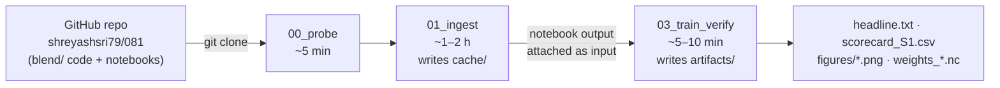

# PS26081 — Running the model on Kaggle, step by step

This guide gets you from zero to the slide-4 number and the weight maps. You need about **2–3 hours**, most of it
waiting for downloads. Nothing here needs a GPU.

## Fast path: one notebook, one cell

New Kaggle notebook → Settings: Internet **On**, Accelerator **None** → paste into one cell → **Save Version → Save & Run All**:

```
!git clone -q https://github.com/shreyashsri79/081 && cd 081 && pip install -q gcsfs "zarr>=2.18,<3" && python run_all.py
```

It downloads 10 files in parallel, trains, verifies, and prints the slide-4 headline. Outputs land in
`/kaggle/working/artifacts/`. The three-notebook route below does the same thing in separate steps.

What runs where:



---

## Part 1 — One-time setup (15 minutes)

### 1.1 Put the code on GitHub

The notebooks download the code with `git clone https://github.com/shreyashsri79/081`. The `blend/` folder and
`notebooks/` folder must therefore be pushed to the `main` branch first. Check this in a browser:
`https://github.com/shreyashsri79/081/tree/main/blend` must show `config.py`, `sources.py`, and the other files.

### 1.2 Create and verify a Kaggle account

1. Go to <https://www.kaggle.com> and sign up (Google sign-in works).
2. Click your profile picture (top right) → **Settings**.
3. Under **Phone verification**, verify your phone number. **Without this, notebooks cannot use the internet**, and
   the notebooks need the internet to clone the code and read the weather data.

---

## Part 2 — Notebook 00: probe the data (5 minutes)

This checks that every data store still exists and has the expected variables. It downloads almost nothing.

1. On Kaggle: left menu **Create** → **New Notebook**.
2. In the notebook: **File** → **Import Notebook** → drag in `notebooks/00_probe.ipynb` from the repo. Confirm.
3. Right panel → **Session options** (or the ⚙ settings panel):
   - **Accelerator:** None
   - **Internet:** On
4. Rename the notebook (top left) to `ps26081-00-probe`.
5. Click **Run All** (the ⏩ button in the toolbar).

**What you should see:** for each model, a line like
`00 UTC inits per year: {2018: 365}` and `Day 1-10 leads present: yes`, then `ERA5 1959-01-01 -> 2023-01-10`.
If any line says `MISSING` or `NO`, stop and send the output to the team.

---

## Part 3 — Notebook 01: download the data (1–2 hours)

This downloads HRES, GraphCast and Pangu forecasts for 2018, 2020 and 2022, plus ERA5 truth, for the India box.
It saves about 150 MB of NetCDF files (10 files) into `/kaggle/working/cache/`.

1. **Create** → **New Notebook** → **File** → **Import Notebook** → `notebooks/01_ingest.ipynb`.
2. Settings: **Accelerator: None**, **Internet: On**.
3. Rename it to `ps26081-01-ingest`.
4. **Optional quick test first (2 minutes):** in the cell that starts with `# ── What to download`, set
   `MAX_INITS = 5`, click **Run All**, and check that it prints one line per model and year without errors. Then
   delete `/kaggle/working/cache` (run `!rm -rf /kaggle/working/cache` in a new cell) and set `MAX_INITS = None` again.
5. Click **Save Version** (top right) → choose **Save & Run All (Commit)** → **Save**.
   A committed run continues on Kaggle's servers even if you close the browser.
6. Watch progress: click the version number next to **Save Version** → **Logs**. Each finished file prints a line like
   `graphcast 2020  inits=366  vars=[...]  3.2 MB  240 s`.
7. When the version shows **Succeeded**, open the notebook's **Output** tab. You should see `cache/` with 10 files:
   `fc_hres_2018.nc … fc_pangu_2022.nc` and `truth_era5.nc`.

**If it times out or fails part way:** open the notebook again (**Edit**) and **Save & Run All** again. Files that
already exist are skipped. Note that a new version starts with an empty `/kaggle/working`, so for a restart that keeps
files, run it interactively (Run All in the editor) rather than as a commit.

---

## Part 4 — Notebook 03: train and verify (5–10 minutes)

1. **Create** → **New Notebook** → **File** → **Import Notebook** → `notebooks/03_train_verify.ipynb`.
2. Settings: **Accelerator: None**, **Internet: On** (to clone the code).
3. Attach the downloaded data: right panel → **Input** → **+ Add Input** → **Your Work** (or **Notebook Output
   Files**) → select `ps26081-01-ingest` → **Add**. The notebook finds the `cache/` folder automatically under
   `/kaggle/input/`.
4. Rename it to `ps26081-03-train-verify`.
5. **Save Version** → **Save & Run All (Commit)**.
6. When it finishes, open **Output**. You get:

| File | What it is |
|---|---|
| `artifacts/headline.txt` | **The slide-4 sentences.** Copy them exactly. |
| `artifacts/scorecard_S1.csv` | RMSE for every model and blend, every lead, with 95 % confidence intervals |
| `artifacts/figures/weights_B2_*_d3.png` | Weight map per model, Day 3 |
| `artifacts/figures/weights_B3s_*_d3_JJAS.png` | Weight map for the monsoon season |
| `artifacts/figures/dominant_*_d3_JJAS.png` | Which model is trusted most in each cell (the visual hook) |
| `artifacts/figures/gain_B3s_vs_B0bc_*_d3.png` | Where the blend beats the best single model (blue = better) |
| `artifacts/figures/rmse_vs_lead_*.png` | RMSE vs lead for each model and each blend |
| `artifacts/weights_S1_*.nc` | The learned weights (used later by the daily run) |
| `artifacts/manifest.json` | Code commit, settings, data stores: what produced these numbers |

---

## Part 5 — Reading the results honestly

The scorecard has these rows (called rungs) for each variable and lead:

| Rung | Meaning |
|---|---|
| `m:hres`, `m:graphcast`, `m:pangu` | Each model on its own, raw |
| `B0` | Best raw single model, chosen on the training years |
| `B0bc` | Best single model after bias correction (the fair bar) |
| `B1` | Equal average of bias-corrected models |
| `B2` | Weighted by past error per grid cell and lead (similar to IMD's MME) |
| `B3s` | B2 plus season |

`verdict_vs_B0` reads:

- **beats**: the whole 95 % confidence interval is below 0. You may say "the blend beats the best single model".
- **matches**: the interval contains 0. Say "matches the best single model". Do not claim a gain.
- **worse**: say so, and show the maps and extremes plan instead.

Always report the `B0bc` comparison next to the `B0` one. Part of any gain over `B0` comes from bias correction
alone, and judges will ask.

---

## Troubleshooting

| Symptom | Fix |
|---|---|
| `git clone` fails / `Could not resolve host` | Internet is Off, or your phone is not verified (Part 1.2) |
| `ModuleNotFoundError: blend` | The code is not on GitHub `main` yet (Part 1.1) |
| `KeyError: leads missing` in 00 | A data store changed. Send the output to the team. |
| `AssertionError: only N inits` in 01 | A download was cut short. Delete that file and run again. |
| 03 prints `cache: /kaggle/working/cache []` | The ingest notebook output is not attached (Part 4 step 3) |
| 03 is slow or runs out of memory | Should not happen at 1.5°. Restart the session and run again. |

## What comes next (after the deck)

1. Add `C.MSLP` to `VARIABLES` in 01 and 03.
2. Rain (set S2): CHIRPS truth loader, then rain in the same notebooks.
3. Regime labels (B3 proper), online update (B4), extremes. See `MODEL_SPEC_81.md` §15.
