# PS26081 — Model Specification

**Hybrid AI–NWP Multi-Model Forecast Blending System · Model spec and Kaggle training plan**
Written 29 Sep 2026. Source documents: `WORKFLOW_AND_DECK_81.md` (stages C0–C13) and `PPT_TEAM_GUIDE_81.md` (§4).
This file is the build contract for the model code in `081/blend/`. Section numbers C0–C13 refer to the workflow document.

---

## Contents

1. [What "the model" is](#1-what-the-model-is)
2. [Problem statement to model requirements](#2-problem-statement-to-model-requirements)
3. [System overview (flowcharts)](#3-system-overview)
4. [Data specification](#4-data-specification)
5. [Model components, one by one](#5-model-components)
6. [The mathematics in one place](#6-the-mathematics-in-one-place)
7. [What "training" means here](#7-what-training-means-here)
8. [Training on Kaggle](#8-training-on-kaggle)
9. [Artifacts the training produces](#9-artifacts-the-training-produces)
10. [Inference: the daily run](#10-inference-the-daily-run)
11. [Verification and acceptance gates](#11-verification-and-acceptance-gates)
12. [Hyperparameters](#12-hyperparameters)
13. [Code layout and interfaces](#13-code-layout-and-interfaces)
14. [Traps and guards](#14-traps-and-guards)
15. [Build order and timeline](#15-build-order-and-timeline)

---

## 1. What "the model" is

The model is **not one neural network**. It is a **statistical blending model** that sits on top of existing weather
models (physics NWP and AI). It learns, from history, **how much to trust each forecast source** in each situation, and
produces one blended forecast plus probabilities of extreme weather.

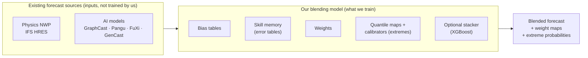

The learned parameters are **tables and small regressors**, indexed by model × variable × lead × season × regime ×
grid cell. This choice is deliberate (see workflow §D2):

| Reason | Detail |
|---|---|
| Little overlapping data | Only 2020 has all five AI models. A deep net would over-fit. |
| Explainability | A forecaster can check any weight by hand: `w ∝ 1 / error²`. |
| PS wording | "Assign adaptive weights" asks for weights, and weight maps are a named deliverable. |
| 36-hour finale | Tables re-fit in minutes when NCMRWF hands us NCUM data. |

A deep-net corrector is listed only as a gated optional rung (B5b, §5.7), never as the core.

---

## 2. Problem statement to model requirements

| ID | PS requirement | Model component that satisfies it |
|---|---|---|
| R1 | Blend physics NWP, ensemble and AI sources | Ingest (C1) loads HRES, GraphCast, Pangu, FuXi, GenCast mean |
| R2 | Weights adaptive, not fixed | Online update rung B4 |
| R3 | Weights from historical skill | Skill memory (C5) |
| R4 | … by lead time | Every table has a `lead` axis |
| R5 | … by region | Every table has `latitude, longitude` axes |
| R6 | … by season | `season` axis |
| R7 | … by weather regime | `regime` axis (C4), rung B3 |
| R8 | Rain, temperature, wind | Variables: `total_precipitation_24hr`, `2m_temperature`, `10m_wind_speed` (+ MSLP) |
| R9 | Extreme weather indicators | Extremes module (C7): heavy rain, heat wave, high wind probabilities |
| R10 | Better than individual models | Verification (C8) vs rung B0 with 95 % CI |
| R11 | Weight maps | Products (C9) from the weight tensor |
| R12 | Automated routine workflow | Daily run (C10) using exported weights |

---

## 3. System overview

### 3.1 End to end: training and operation

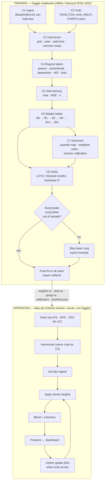

### 3.2 One forecast, one grid cell: how a number is made

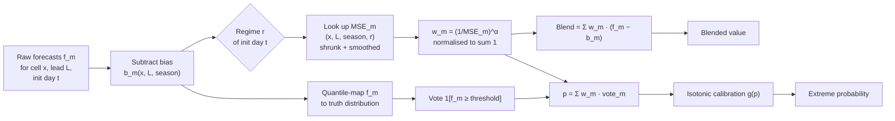

---

## 4. Data specification

### 4.1 Frozen scope (C0) — copy into `081/blend/config.py`

| Item | Value |
|---|---|
| Domain | 5–40° N, 65–100° E |
| Dev grid | 1.5° (WB2 `240x121_equiangular_with_poles_conservative`) → 24 × 24 = 576 cells |
| Final grid | 0.25° (probe WB2 store names first; do not guess them) |
| Variables | `total_precipitation_24hr`, `2m_temperature`, `10m_wind_speed`, `mean_sea_level_pressure` |
| Regime-only fields | ERA5 `geopotential` at 500 hPa, `mean_sea_level_pressure`; optional 850 hPa `u/v` |
| Inits | 00 UTC only |
| Leads | Day 1–10, 24 h steps (10 leads) |
| Split | S1/S2 leave-one-year-out; S3/S4 blocked months within 2020 |

**Changing the split invalidates every number.** Freeze it before the first score is written down.

### 4.2 Sources (verified in workflow §B4)

| Source | Role | Years | Rain | T2m / wind / MSLP |
|---|---|---|---|---|
| IFS HRES | Physics NWP | 2016–2022 | yes | yes |
| GraphCast | AI | 2018, 2020, 2022 (three stores) | yes | yes |
| Pangu-Weather | AI | 2018–2022 | **no** | yes |
| FuXi | AI | 2020 | yes (`total_precipitation_24hr_from_6hr`) | yes |
| GenCast (mean) | AI ensemble | 2020 | yes | yes |
| ERA5 | Truth (T2m, wind, MSLP), regimes, climatology | 1959 – 10 Jan 2023 (store `era5/1959-2023_01_10-6h-…`; the `1959-2022` store ends on 31 Dec 2021 and cannot score 2022) | weak truth | yes |
| CHIRPS 2.0 daily | Truth for rain, land only | 1981–present | yes | — |

### 4.3 Model sets

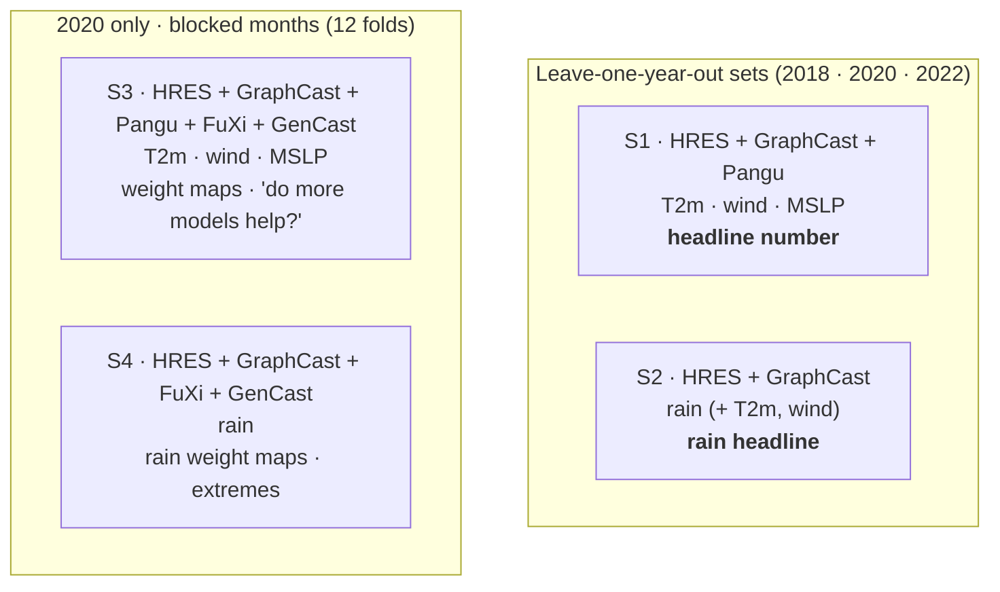

### 4.4 Tensor shapes (1.5° dev grid)

| Array | Dims | Size (one year, float32) |
|---|---|---|
| Forecast `fc` | `(model, init, lead, latitude, longitude)` per variable | 3 × 366 × 10 × 24 × 24 ≈ 25 MB |
| Truth `obs` | `(init, lead, latitude, longitude)` aligned on valid time | ≈ 8 MB |
| Regime label | `(init,)` categorical | tiny |
| Weights | `(model, var, lead, season, regime, latitude, longitude)` | 5 × 4 × 10 × 4 × 6 × 576 ≈ 11 MB |

All S1–S4 data at 1.5° fits in **< 1 GB of RAM**. At 0.25° the S1 set is ≈ 3 GB on disk; load one variable at a time.

---

## 5. Model components

Each component lists **inputs, outputs, method, and done-when check**.

### 5.1 Ingest (C1) — `sources.py`

- **In:** WB2 zarr URLs. **Out:** `cache/{model}.zarr`, dims `(init, lead, latitude, longitude)`.
- **Method:** open anonymously; rename `lat/lon → latitude/longitude`, `time → init`, `prediction_timedelta → lead`;
  sort latitude ascending; slice the India box; keep 00 UTC and leads 1–10 d; keep only variables the model has.
  If a store has only `10m_u_component_of_wind` and `10m_v_component_of_wind`, compute `10m_wind_speed = hypot(u, v)`.
- **Check:** 10 leads; ~365 inits per year; GraphCast has all three year stores; no all-NaN slices.

### 5.2 Harmonise (C2) — `harmonise.py`

- Rain `m → mm` (`× 1000`). Temperature stays in K internally.
- Add coordinate `valid = init + lead`.
- 24 h rain must be the window ending at `valid` for every model. Check on one known heavy-rain day.
- **Common mask:** a cell/day is dropped if any model in the set is missing it. Every model is scored on the same cases.
- **Check:** monthly mean difference between two models is tenths of a unit, not orders of magnitude.

### 5.3 Truth (C3) — `truth.py`

| Variable | Truth | Note |
|---|---|---|
| T2m, 10 m wind, MSLP | ERA5 on the same WB2 grid | Slightly favours HRES (same system). State it. |
| 24 h rain | CHIRPS 2.0 daily, conservatively regridded, land only | Align the CHIRPS day to the forecast 24 h window ending at `valid`. Check on a known event. |
| 24 h rain (upgrade) | IMD 0.25° gridded | Only if downloadable. |

Output `truth[var][valid, latitude, longitude]`; align with `truth.sel(valid=fc.valid)`.

### 5.4 Regime labels (C4) — `regimes.py`

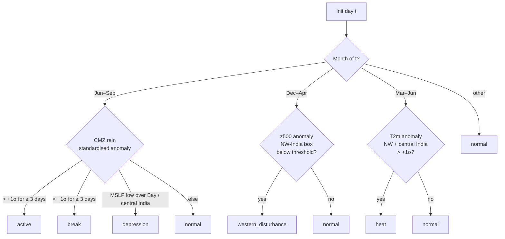

- Labels: `normal, active, break, depression, western_disturbance, heat` (6). Priority when two fire: depression >
  active/break > heat > western_disturbance > normal.
- **Leakage rule:** weights use the **init-day regime** (known at forecast time). Optional: the regime computed from the
  models' own forecast fields for the valid day (majority vote). **Never** the true valid-day regime.
- Anomalies are against the ERA5 / CHIRPS climatology of the **training years only** inside each fold.
- **Check:** the 2020 JJAS calendar matches published active/break dates.

### 5.5 Skill memory (C5) — `skill.py`

Tables, all fitted on training folds only:

| Table | Key | Value |
|---|---|---|
| `bias` | model, var, lead, season, cell | `mean(f − o)` |
| `mse` | model, var, lead, season, regime, cell | `mean((f − bias − o)²)` |
| `n` | same as `mse` | case count |

Then **3 × 3 spatial smoothing** and **shrinkage of regime toward season** (formula §6.3).

### 5.6 Weight ladder (C6) — `weights.py`

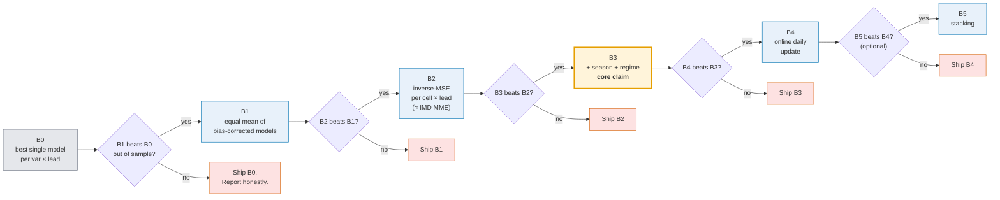

"Beats" means: lower RMSE on held-out folds **and** the paired-bootstrap 95 % CI of the RMSE difference excludes 0
(§11). The gap B2 → B3 is our contribution over IMD's existing multi-model ensemble.

### 5.7 Optional rung B5 — stacking (`stack.py`)

Only built if B4 is done and verified. Two variants, each gated against B4:

| Variant | Method | Features | Target |
|---|---|---|---|
| B5a | Constrained least squares per region × lead × season (weights ≥ 0, Σ = 1) | Bias-corrected model forecasts | Truth |
| B5b | XGBoost residual corrector on top of B3/B4 | Bias-corrected forecasts, model spread (std), B3 blend, lead, `sin/cos(day-of-year)`, regime one-hot, lat, lon | `truth − blend_B3` |

B5b keeps the weight maps meaningful: the weights still come from B3/B4, and XGBoost only adds a small learned
correction. Training rows at 1.5° for S1: 576 cells × ~730 training inits × 10 leads ≈ 4.2 M per variable. This is the
**only** part that benefits from a Kaggle GPU.

### 5.8 Extremes (C7) — `extremes.py`

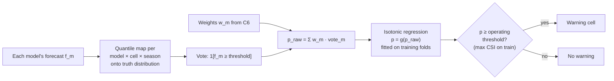

| Indicator | Threshold |
|---|---|
| Heavy rain | IMD 64.5 mm / 24 h (also 115.6 and 204.5) at 0.25°. At 1.5° a cell is a ~167 km area mean, so also report the 95th and 99th percentile of truth per cell. |
| Heat wave | IMD rule: T ≥ 40 °C plains / 37 °C coast / 30 °C hills **and** departure ≥ 4.5 °C; or T ≥ 45 °C. Uses 12 UTC T2m as a Tmax proxy. Normal = ERA5 1991–2020 day-of-year climatology, 31-day window. |
| High wind | 10 m wind ≥ 15 m/s (our stated choice) |

**Never read extremes from the blended mean.** Averaging smooths peaks: 90 mm and 30 mm average to 60 mm, below the
heavy-rain line.

---

## 6. The mathematics in one place

Notation: model `m`, cell `x`, lead `L`, init day `t`, season `s(t)`, regime `r(t)`, forecast `f`, truth `o`.

### 6.1 Bias correction

```
b_m(x, L, s)  = mean over training t in season s of [ f_m(x, L, t) − o(x, t + L) ]
f̃_m(x, L, t)  = f_m(x, L, t) − b_m(x, L, s(t))
```

### 6.2 Skill memory

```
MSE_m(x, L, s, r) = mean over training t with s(t)=s, r(t)=r of [ f̃_m(x, L, t) − o(x, t + L) ]²
n(x, L, s, r)     = number of such t
```

### 6.3 Shrinkage and smoothing

```
MSE_used = ( n · MSE_regime + k · MSE_season ) / ( n + k )        k ≈ 20 cases
MSE_used ← mean over the 3 × 3 cell neighbourhood of MSE_used
```

### 6.4 Weights and blend

```
w_m = (1 / MSE_used,m)^α  /  Σ_j (1 / MSE_used,j)^α               α = 1 default; α = 0 gives B1
blend(x, L, t) = Σ_m  w_m(x, L, s(t), r(t)) · f̃_m(x, L, t)
```

A model with half the error gets `2^(2α)` times the weight (4× at α = 1).

### 6.5 Online update (B4)

```
MSE_t = λ · MSE_{t−1} + (1 − λ) · e_t²          λ ≈ 0.95  (≈ 20-day memory)
```

**Timing rule:** at init `t`, an error `e` for lead `L` is usable only if its valid time `t' + L ≤ t`. A Day-10
forecast issued on day `t'` is scored on day `t' + 10`, not before.

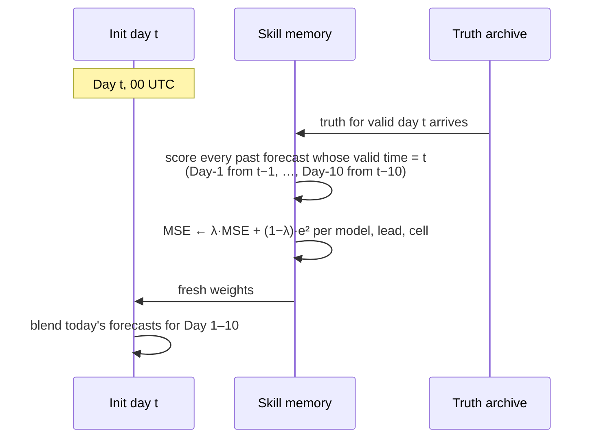

### 6.6 Extremes

```
f̂_m        = QM_m,x,s( f_m )                       quantile mapping to truth
p_raw       = Σ_m w_m · 1[ f̂_m ≥ threshold ]
p           = g( p_raw )                             isotonic, fitted on training folds
```

### 6.7 Scores

```
RMSE = sqrt(mean((f − o)²))       SS = 1 − RMSE_blend / RMSE_B0
CSI  = H / (H + M + F)            ETS = (H − Hr) / (H + M + F − Hr),  Hr = (H + M)(H + F) / N
FSS  = 1 − mean((P_f − P_o)²) / (mean(P_f²) + mean(P_o²))
BSS  = 1 − BS / BS_climatology
```

Scores are latitude-weighted (`cos(latitude)`) when averaged over the domain.

---

## 7. What "training" means here

Training = **fitting the tables and calibrators on training folds, then scoring on the held-out fold**. There is no
gradient descent in the core model.

### 7.1 Fold loop (S1 / S2, leave-one-year-out)

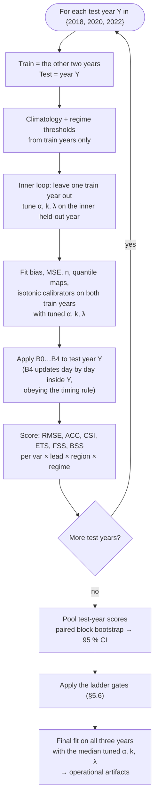

### 7.2 Fold loop (S3 / S4, blocked months in 2020)

Same loop with 12 folds: test = one calendar month of 2020, train = the other 11. Leave a **5-day gap** on both sides of
the test month so correlated neighbouring days do not leak.

### 7.3 Never

- Random-day splits (consecutive days are correlated; skill is inflated).
- Thresholds, climatologies or regimes computed with test-year data.
- The true valid-day regime used for weights.

---

## 8. Training on Kaggle

### 8.1 Why Kaggle and what it gives

| Resource | Use here |
|---|---|
| CPU notebook (≈ 4 cores, ≈ 30 GB RAM) | Everything in the core model. 1.5° runs in minutes; 0.25° in about an hour. |
| GPU notebook (T4 × 2 or P100) | Only B5b XGBoost. Not needed for B0–B4. |
| Internet access (needs a phone-verified account) | Read WB2 from Google Cloud Storage, CHIRPS over HTTPS, and `git clone` the repo. |
| `/kaggle/working` (≈ 20 GB, saved with a version) | Cache zarr stores and artifacts. |
| Kaggle Datasets | Freeze the cache once; later notebooks attach it read-only at `/kaggle/input/...`. |

Session limit is about 12 h, and GPU quota is about 30 h per week. Confirm the current limits in your Kaggle settings;
they change. The plan below keeps every notebook far under them.

### 8.2 Notebook pipeline

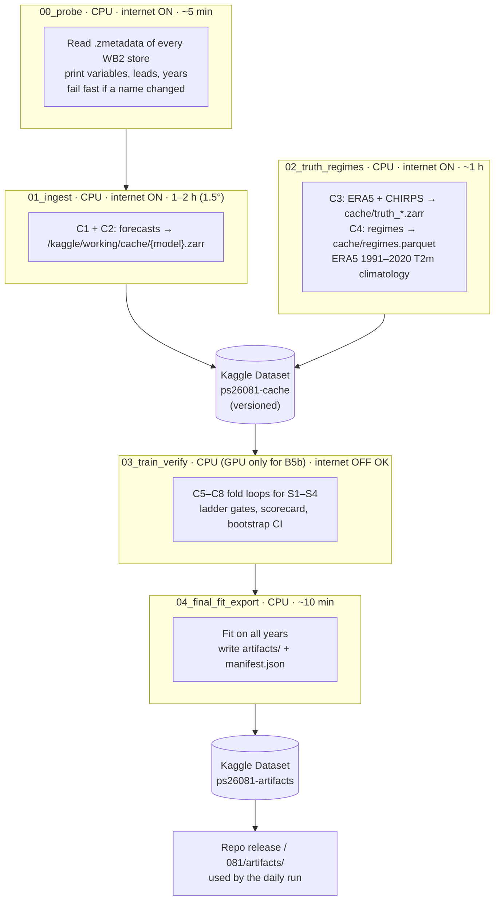

Rule: **download once, train many times.** Notebooks 01–02 are the only ones that touch the network for data.
Notebook 03 is re-run freely while tuning.

### 8.3 Notebook setup cell (all notebooks)

```python
# Kaggle: Settings → Internet ON (01, 02); accelerator None (GPU only for B5b in 03)
!pip install -q "xarray>=2024.1" "zarr<3" gcsfs dask netcdf4 xesmf scikit-learn xgboost
!git clone -q https://github.com/shreyashsri79/081 /kaggle/working/repo
import sys; sys.path.insert(0, "/kaggle/working/repo")
import subprocess, json
COMMIT = subprocess.check_output(["git", "-C", "/kaggle/working/repo", "rev-parse", "HEAD"]).decode().strip()

import numpy as np, random
SEED = 26081
np.random.seed(SEED); random.seed(SEED)

CACHE = "/kaggle/working/cache"          # in 01/02 (write)
# CACHE = "/kaggle/input/ps26081-cache"  # in 03/04 (read-only, attached dataset)
ART   = "/kaggle/working/artifacts"
```

If `xesmf` fails to install on the Kaggle image, use the area-weighted block mean regrid in `harmonise.py` instead
(CHIRPS 0.25° to 1.5° is an exact 6 × 6 block).

### 8.4 Ingest cell (notebook 01)

```python
from blend.config import MODELS, SETS
from blend.sources import load
from blend.harmonise import harmonise

for model in MODELS:                       # hres, graphcast, pangu, fuxi, gencast
    ds = harmonise(load(model))
    assert ds.sizes["lead"] == 10
    print(model, dict(ds.sizes), list(ds.data_vars))
    ds.chunk({"init": 92}).to_zarr(f"{CACHE}/{model}.zarr", mode="w")
```

Then **Save Version → Save & Run All**. After it finishes: Output tab → **New Dataset** → name `ps26081-cache`.
Notebook 02 output is added as a new version of the same dataset.

### 8.5 Train-and-verify cell (notebook 03)

```python
from blend.verify import run_folds
from blend.products import scorecard

results = {}
for set_name in ["S1", "S2", "S3", "S4"]:
    results[set_name] = run_folds(set_name, cache=CACHE, rungs=["B0", "B1", "B2", "B3", "B4"],
                                  n_boot=1000, block_days=5, seed=SEED)
scorecard(results).to_json(f"{ART}/scorecard.json", orient="records", indent=1)
```

For B5b on GPU: switch the accelerator to GPU and use `xgboost` with `device="cuda", tree_method="hist"`.

### 8.6 Memory and time budget

| Step | 1.5° | 0.25° |
|---|---|---|
| Ingest all models | 1–2 h (network bound) | several hours; split across sessions by model |
| Disk for cache | < 1 GB | ≈ 3–8 GB |
| Fold loop S1–S4, B0–B4 | minutes | < 1 h (process one variable at a time) |
| B5b XGBoost (GPU) | minutes per variable | ≈ 30 min per variable |

At 0.25°, open zarr with dask chunks and reduce over `init` lazily; call `.compute()` only on the final tables.

---

## 9. Artifacts the training produces

```
artifacts/
  manifest.json              # git commit, config hash, data store URLs, dataset versions, seed, date, shipped rung per var
  config.json                # frozen C0 scope
  skill/
    bias.nc                  # (model, var, lead, season, latitude, longitude)
    mse.nc                   # (model, var, lead, season, regime, latitude, longitude)
    n.nc                     # same dims as mse
  weights/
    weights_S1.nc … S4.nc    # (model, var, lead, season, regime, latitude, longitude); Σ_model = 1
    tuned.json               # α, k, λ per set
  extremes/
    qmap.nc                  # quantiles (model, var, season, quantile, latitude, longitude)
    iso_{var}_{thr}.json     # isotonic breakpoints (x, y) — plain JSON, no pickle
    operating_thresholds.json
  stack/                     # only if B5 shipped
    xgb_{var}_lead{L}.json
  verify/
    scorecard.json           # var × lead × rung × region × regime: RMSE, SS, CI low/high
    events.json              # POD, FAR, CSI, ETS, FSS, BSS per threshold
    figures/                 # weight maps, dominant-model maps, RMSE-vs-lead, reliability diagrams
```

The daily run and dashboard read only `artifacts/`. They never import training code paths that need WB2.

---

## 10. Inference: the daily run

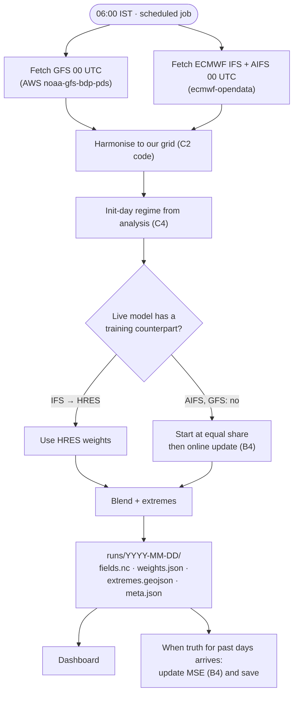

Say plainly on the deck: the live models are not all the models the weights were learned on. GraphCast and Pangu are
not served daily in the open, so they are not in the live run unless we run them ourselves on a GPU.

NCUM / NEPS-G enter through `adapters/ncum.py` and `adapters/nepsg.py`, which implement the same loader interface
(§13). With NCMRWF data, notebook 03 re-fits their weights in minutes.

---

## 11. Verification and acceptance gates

### 11.1 Protocol

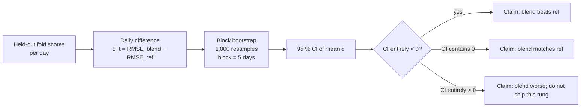

Breakdown: region (NW, central, NE, south peninsula, Bay of Bengal, Arabian Sea) × regime × lead.

### 11.2 Acceptance gates

| Gate | Pass condition |
|---|---|
| G1 data | Every model: 10 leads, expected init count per year, variable list matches §4.2 |
| G2 alignment | All models peak on the same valid day for a known heavy-rain event |
| G3 weights | Σ weights = 1 in every cell; no NaN; maps smooth, not speckled |
| G4 ladder | Each shipped rung beats the one below with CI excluding 0 on pooled held-out folds |
| G5 extremes | Blend-mean heavy-rain frequency bias < 1 (smoothing confirmed); probability product frequency bias ≈ 1; BSS > 0 |
| G6 reproducible | Two clean runs of notebook 03 give identical scorecards |
| G7 honest | Bias correction (B1) gain reported separately from weighting gain (B2–B4) |

### 11.3 The one headline line (slide 4)

S1, T2m and 10 m wind, rungs B0 / B1 / B2, LOYO, 1.5°:

> "T2m Day-3 RMSE: best single X K → blend Y K (−Z %, 95 % CI [a, b]), leave-one-year-out 2018/20/22."

If the CI contains 0, the slide says "matches the best single model". Never a made-up number.

---

## 12. Hyperparameters

| Name | Default | Search range | Tuned how |
|---|---|---|---|
| `α` weight temperature | 1.0 | 0, 0.5, 1, 2, 4 | Inner LOYO on train years |
| `k` shrinkage strength | 20 | 5, 10, 20, 40 | Inner LOYO |
| `λ` online memory | 0.95 | 0.90, 0.95, 0.98 | Inner LOYO |
| Spatial smoothing | 3 × 3 | 1 × 1, 3 × 3, 5 × 5 | Inner LOYO |
| Regime count | 6 | ≥ 2 (season + active/break minimum) | Fixed before scoring |
| Quantiles for mapping | 99 (1–99 %) + max | — | Fixed |
| Bootstrap | 1,000 × 5-day blocks | — | Fixed |
| High-wind threshold | 15 m/s | — | Stated choice |
| B5b XGBoost | `max_depth=6, eta=0.05, n_estimators≤2000, early_stopping=100` | depth 4–8 | Inner fold |
| Seed | 26081 | — | Fixed |

---

## 13. Code layout and interfaces

```
081/
  blend/
    config.py      # C0 frozen scope (§4.1)
    sources.py     # C1 load(model) -> xr.Dataset (init, lead, latitude, longitude)
    harmonise.py   # C2 harmonise(ds), common_mask(dsets)
    truth.py       # C3 load_truth(var) -> xr.DataArray (valid, latitude, longitude)
    regimes.py     # C4 label(init_dates, train_years) -> pd.Series
    skill.py       # C5 fit_skill(fc, obs, regime) -> (bias, mse, n)
    weights.py     # C6 weights(mse_used, alpha), blend(fc, bias, w), online_update(mse, err, lam)
    stack.py       # B5 optional
    extremes.py    # C7 fit_qmap, exceed_prob, fit_isotonic
    verify.py      # C8 run_folds, bootstrap_ci, metrics
    products.py    # C9 scorecard, weight maps, dominant-model map
    daily.py       # C10 operational job
    server.py      # C11 FastAPI
    adapters/ncum.py, adapters/nepsg.py   # C12
  notebooks/
    00_probe.ipynb  01_ingest.ipynb  02_truth_regimes.ipynb  03_train_verify.ipynb  04_final_fit_export.ipynb
  artifacts/       # small exported files (gitignored if large; attach to a release)
  data/            # gitignored cache
```

**Loader contract (every source and adapter):**

```python
def load(model: str) -> xr.Dataset:
    """Return dims (init, lead, latitude, longitude); latitude ascending;
    lead as timedelta64 days 1..10; 00 UTC inits; variable names from config.VARS;
    precipitation in metres (harmonise converts); missing variables simply absent."""
```

Adding a model = one entry in `config.MODELS` + one loader. Nothing downstream changes.

---

## 14. Traps and guards

| Trap | Consequence | Guard |
|---|---|---|
| Random-day split | Inflated skill | Year / blocked-month splits with 5-day gaps |
| Rain verified on ERA5 | Rewards ERA5-like models | CHIRPS / IMD |
| True valid-day regime in weights | Leakage | Init-day or forecast regime |
| Test-year data in climatology or thresholds | Leakage | Compute inside each fold from train years only |
| Online update uses errors not yet observable | Leakage | Timing rule §6.5 |
| Extremes from the blended mean | Heavy rain under-forecast | Probabilities (§5.8) |
| T2m instantaneous, not Tmax | Heat-wave rule mis-applied | 12 UTC proxy + calibration, stated |
| Tiny regime bins | Noisy weights | Shrinkage + smoothing |
| Credit taken for bias correction | Misleading claim | Report B1 separately |
| Models scored on different days | Unfair comparison | Common mask |
| One GraphCast year store missed | Smaller training set, silently | Assert init counts in notebook 01 |
| Kaggle session expires mid-ingest | Lost download | One model per cell; write zarr per model; re-run skips existing stores |
| Package drift between runs | Numbers change | Pin versions; record commit and dataset version in `manifest.json` |

---

## 15. Build order and timeline

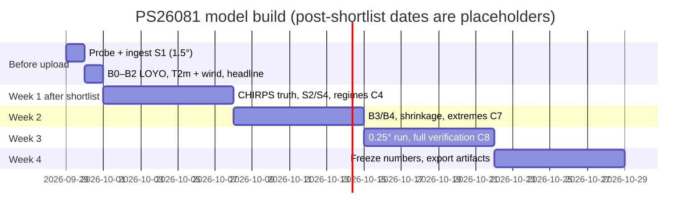

**Minimum viable model (for the 30 Sep deck):** notebooks 00, 01 and 03 on S1 only, T2m and 10 m wind, rungs B0–B2,
1.5° grid. Output: the slide-4 line and one weight-map PNG.
