# PS26081 — The PPT team guide

**Hybrid AI–NWP Multi-Model Forecast Blending System** · MoES / NCMRWF · Software · Theme: Miscellaneous

Written 29 Sep 2026 · Portal closes **30 Sep 2026** · Deliverable: **one PDF, six slides at most**

This guide is for the people building the deck. It assumes you know **nothing** about the problem statement, weather models or India's monsoon. It takes you from "what is this about" to "here is exactly what goes on each slide", with diagrams you can copy.

The technical depth behind it lives in [`WORKFLOW_AND_DECK.md`](WORKFLOW_AND_DECK.md). You do not need to read that. If a judge question goes beyond this guide, ask the model team and add the answer to Part 10.

### How to read this

| You are | Read | Time |
|---|---|---|
| In a hurry | Part 0, then Part 8 | 15 min |
| New to the topic | Parts 0 to 3, then Part 8 | 45 min |
| Designing the slides | Parts 6, 7, 8 | 30 min |
| Rehearsing Q&A | Part 10 | 20 min |

### Contents

0. [The whole idea in 60 seconds](#0-the-whole-idea-in-60-seconds)
1. [The story: what problem are we solving](#1-the-story)
2. [Primer: weather forecasting for people who never studied it](#2-primer)
3. [The problem statement, decoded](#3-the-problem-statement-decoded)
4. [Our solution in depth](#4-our-solution-in-depth)
5. [What is real, what is planned, what we must not say](#5-real-planned-forbidden)
6. [What the two winning decks do (and what we will not copy)](#6-lessons-from-the-winning-decks)
7. [Visual system](#7-visual-system)
8. [The deck, slide by slide](#8-the-deck-slide-by-slide)
9. [Prototype link, video, QR](#9-prototype-link-video-qr)
10. [Judge questions with answers](#10-judge-questions)
11. [Production plan and checklist](#11-production-plan-and-checklist)
12. [Glossary](#12-glossary)

---

## 0. The whole idea in 60 seconds

Every day, several computer programs forecast India's weather. Some solve physics equations. Some are AI trained on 40 years of past weather. They **disagree**, and none of them is best everywhere. One is better for rain in the Western Ghats, another for temperature in the north-west, another for days 7 to 10.

Forecasters today combine them by experience, or with a fixed recipe made in 2008 that mixes only physics models. We build a system that looks at each model's **track record** and decides, for every place, every number of days ahead, every season and every type of monsoon weather, **how much to trust each one**. It then blends them into one forecast, shows a **map of who it trusted where**, gives **probabilities for heavy rain, heat waves and strong wind**, and proves on years it never saw that the blend is better than any single model.

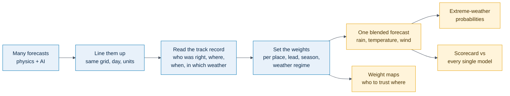

**Our one-line pitch:** *Right model, right place, right weather.*

**Our promise to the judges:** every number on the deck was measured on data the system had not seen, and where the blend does not help, we say so.

---

## 1. The story

Use this as the mental picture for the whole deck. It is also the story to tell a judge who asks "explain it simply".

### 1.1 Five friends give you directions

You are driving in an unfamiliar city. You ask five friends the way to the airport.

- Friend A knows the old city very well.
- Friend B has a brilliant sense of direction on highways but gets confused in lanes.
- Friend C is always right at night and wrong in the morning rush.
- Friends D and E are good in some districts and hopeless in others.

They give five different routes. What do you do? You do **not** average the five routes into one invented road. You also do not always follow the same friend. You think: *"For the old city I trust A. On the highway I trust B. It is night, so C."* You weigh each friend by how reliable they have been **in this kind of situation**.

Weather forecasting has exactly this problem. The friends are forecast models. The situations are the region, the season, how many days ahead you look, and the type of weather.

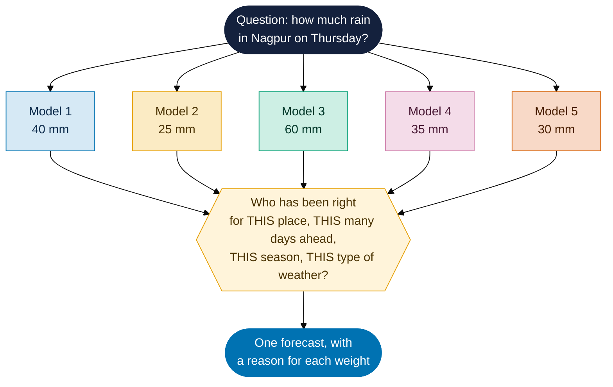

*The numbers in this picture are invented to show the idea. If you use it on a slide, write "illustrative".*

### 1.2 Why it matters to real people

| Who | What a better forecast changes |
|---|---|
| A district officer in a flood-prone area | Whether to move families out before the rain, or not |
| A farmer, through the state's weather advisories | Whether to sow, spray or irrigate this week |
| A power-grid planner | How much solar and wind to expect, and how much heat-driven demand |
| A city facing a heat wave | Whether to issue a warning and open cooling shelters |

The forecasts that matter most are the **extreme** ones: very heavy rain, heat waves, strong wind. These are also the ones models handle worst. That is why the problem statement asks for extreme-weather guidance specifically.

### 1.3 The gap we fill

- Forecasters already know that a blend beats one model. IMD has run a **multi-model ensemble since 2008**, which combines several physics models with weights from their past skill.
- That recipe was built before AI weather models existed. It uses **fixed weights**. It does not change with the type of monsoon weather.
- AI weather models (GraphCast, Pangu-Weather, FuXi, GenCast) now match or beat physics models on many measures. Google DeepMind's GraphCast paper reports that it beat ECMWF's top deterministic model on about 90% of the 1,380 targets tested. *(Check the exact wording against the Science 2023 paper before printing this on a slide.)*
- Nobody has an easy way to **mix physics and AI models with weights that adapt to the weather**. That is the problem statement.

---

## 2. Primer

Everything you need to understand the rest of the guide. Skim what you know.

### 2.1 What a weather forecast is

A **weather model** is a computer program. It takes the current state of the atmosphere (temperature, wind, humidity, pressure at every point on a grid) and moves it forward in time. The output is a forecast for each future time step.

The **grid** is a chessboard laid over the Earth. Each square holds one number per variable. Smaller squares give finer detail and cost more computing. "0.25 degrees" means each square is about 28 km wide. "1.5 degrees" is about 167 km.

### 2.2 The three families of forecast source

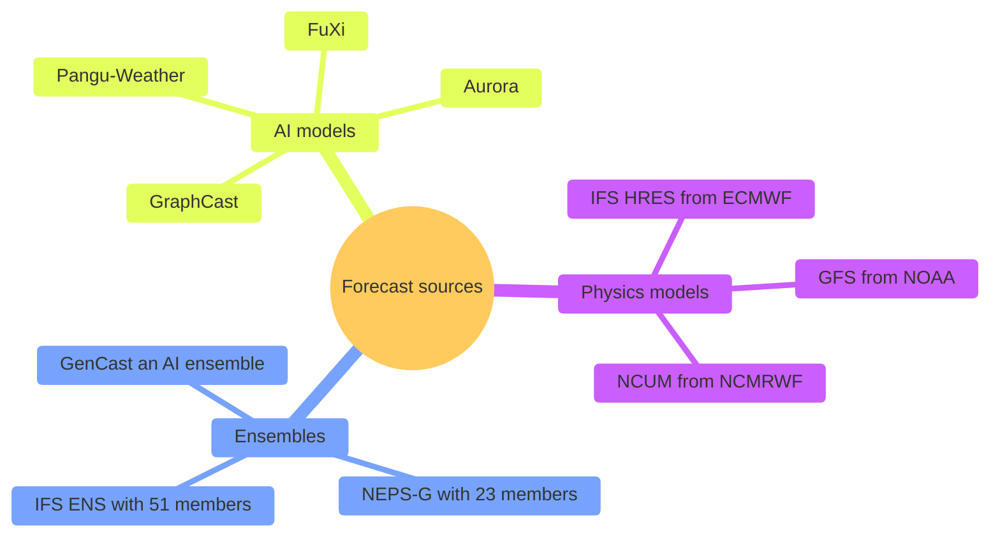

| Family | How it works | Strength | Weakness |
|---|---|---|---|
| **Physics model (NWP)** | Solves the equations of fluid motion and heat on the grid, step by step | Physically consistent. Can produce rare events it has not seen | Expensive to run. Has systematic errors |
| **Ensemble** | Runs one model many times from slightly different starts. The spread between runs shows uncertainty | Tells you how sure to be | Costs many times more |
| **AI model** | A neural network trained on decades of past weather (the ERA5 record). It learns to step the atmosphere forward | Fast. Often lower average error at 3 to 10 days | Fields look smoother, so it tends to under-predict extremes |

The two names you will hear most: **HRES** (ECMWF's flagship physics model) and **GraphCast** (Google DeepMind's AI model). For India, the home model is **NCUM**, run by NCMRWF at 12 km.

### 2.3 The words in the title of this problem

| Word | Meaning |
|---|---|
| **Hybrid** | Physics and AI together. In this problem, the blend itself is the hybrid |
| **AI–NWP** | AI models and Numerical Weather Prediction (physics) models |
| **Multi-model** | Many models at once |
| **Blending** | Combining forecasts as a weighted average: `blend = w1·model1 + w2·model2 + …` with weights that add up to 1 |
| **Forecast source** | Any one of the models above |

### 2.4 Ideas you must understand to explain the system

| Idea | In plain words | Example |
|---|---|---|
| **Lead time** | How far ahead the forecast looks. Day 1 is tomorrow. Day 10 is ten days out | AI models tend to gain on physics models at longer leads, so their weight should rise with lead |
| **Truth** | The best record of what actually happened, used to grade forecasts | ERA5 for temperature and wind. CHIRPS (satellite plus gauges) for rain |
| **Error** | Forecast minus truth | Forecast 32 °C, real 35 °C: error of −3 °C |
| **Bias** | A model's average error. A model always 2 °C too warm has a bias of +2 °C | Remove the bias first, then blend |
| **Skill** | How good a forecast is compared with a reference | "8% lower error than the best single model" |
| **Weight** | How much a model counts in the blend | 0.6 for model A, 0.4 for model B |
| **Weight map** | A map showing, for each square, which model gets how much weight | Our best visual |
| **Out-of-sample** | Graded on data the system never saw while it learned | The only honest test |
| **Leakage** | Accidentally letting the answer into the learning stage, so results look better than they are | The most common way weather-AI papers overstate results |

### 2.5 The Indian monsoon in one page

India gets most of its annual rain in **June to September** (called **JJAS**). It is not steady.

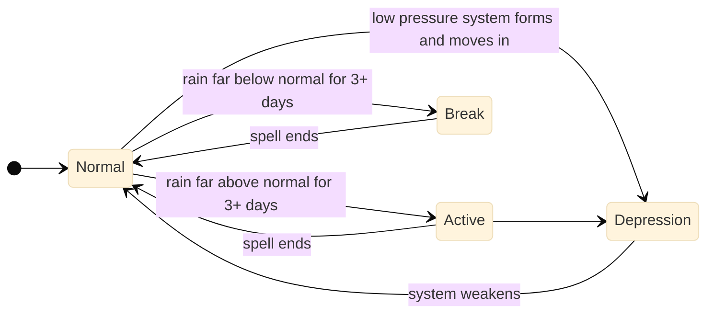

| Weather regime | What it is | Why a blend cares |
|---|---|---|
| **Active spell** | A wet stretch, widespread rain over central India | Some models over-rain, some under-rain in an active spell |
| **Break spell** | A dry stretch in mid-season. Rain moves to the Himalayan foothills | A model that is good in a wet spell can be poor here |
| **Monsoon depression** | A spinning low-pressure system, usually from the Bay of Bengal, that drags heavy rain across central India | The track is hard to predict. Models disagree strongly |
| **Western disturbance** | A winter and spring system from the west that brings rain and snow to north India | The statement names it |
| **Heat wave** | Very hot spell in March to June in north and central India | Extreme-weather target |

A **weather regime** is one of these recurring patterns. The statement says the weights must depend on it. The reason is simple: the model that wins in an active spell is not necessarily the one that wins in a break.

**IMD's official rain categories** (per 24 hours) are what warnings use:

| Category | Rain in 24 h |
|---|---|
| Heavy | 64.5 to 115.5 mm |
| Very heavy | 115.6 to 204.4 mm |
| Extremely heavy | 204.5 mm or more |

**IMD heat wave:** maximum temperature at or above 40 °C on the plains (37 °C on the coast, 30 °C in the hills) **and** at least 4.5 °C above normal; or 45 °C or more regardless.

### 2.6 The organisations

| Name | Who | Role in this problem |
|---|---|---|
| **MoES** | Ministry of Earth Sciences | The ministry that posted the problem |
| **NCMRWF** | National Centre for Medium Range Weather Forecasting, Noida | Runs NCUM and NEPS-G. Owns the problem. Their scientists are the likely judges |
| **IMD** | India Meteorological Department | Issues the official forecasts and warnings. Has the multi-model ensemble |
| **ECMWF** | European Centre for Medium-Range Weather Forecasts | Makes HRES, the best-known physics model |

### 2.7 The scoring numbers, in plain words

Judges in this field ask for these by name. You need to understand them; the deck uses only a few.

| Metric | Question it answers | Good |
|---|---|---|
| **RMSE** | How large are the errors, punishing big misses? Our headline for continuous variables | Lower |
| **Bias** | Is the model consistently too warm, too wet? | 0 |
| **Skill score** | By what percent did we beat a reference? `1 − RMSE_blend / RMSE_reference` | Above 0 |
| **POD** | Of the heavy-rain events that happened, how many did we catch? | Higher |
| **FAR** | Of our heavy-rain warnings, how many were false alarms? | Lower |
| **CSI** | Overall hit rate, counting misses and false alarms | Higher |
| **ETS** | Like CSI but discounts luck | Higher |
| **FSS** | Was the rain roughly in the right place, allowing for a small position error? Judges from NCMRWF like this one | Higher |
| **Brier skill score** | Are our probabilities good? | Above 0 |
| **Reliability diagram** | When we say "40%", does it happen 40% of the time? | On the diagonal |
| **95% confidence interval** | The range the true value probably lies in. A gain counts only if the range excludes zero | Excludes 0 |

---

## 3. The problem statement, decoded

### 3.1 The official text

> Different forecasting systems perform differently depending on region, season, lead time and weather situation. Physical NWP models, ensemble forecasts and AI/ML weather models may each have strengths under different conditions. Therefore, there is a need for an intelligent blending system that can dynamically combine multiple forecasts.
>
> The challenge is to develop a hybrid AI–NWP blending framework that assigns adaptive weights to different forecast sources based on historical skill, forecast lead time, region, season and weather regime. The final product should provide an optimized forecast for rainfall, temperature, wind and extreme weather indicators.

### 3.2 What each part demands

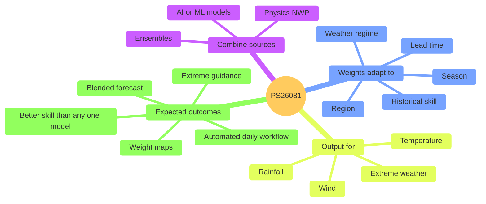

### 3.3 The five expected outcomes and our answer

| # | The statement expects | We deliver | The proof we show | Slide |
|---|---|---|---|---|
| 1 | A dynamically blended forecast | Rain, temperature, wind, Day 1 to 10, daily | Blend maps | 2, 3 |
| 2 | Model weight maps | One map per model per lead, plus a "dominant model" map | The animated weight map | 2 |
| 3 | Better skill than each model alone | Blend against the best single model and the equal average | Scorecard with confidence intervals | 4 |
| 4 | Extreme-weather guidance | Probabilities of heavy rain, heat wave, high wind | POD, FAR, CSI, FSS and reliability | 3, 4 |
| 5 | An automated, routine workflow | Daily job plus dashboard | Screenshot of the dashboard and run log | 3, 5 |

### 3.4 What we may change and what we may not

| Fixed by the statement or template | Ours to choose |
|---|---|
| Blend at least one physics model and one AI model | Which models |
| Weights depend on skill, lead, region, season, regime | How the weights are computed |
| Output rain, temperature, wind, extremes | Resolution, area, number of days |
| Must beat individual models | Which metric leads the deck |
| Weight maps are delivered | How they look |
| Six slides at most, template headings unchanged, PDF only | Wording, pictures, layout inside each slide |

---

## 4. Our solution in depth

Seven pieces. Each has a plain explanation, a diagram, and the sentence you can say about it.

### 4.1 The whole pipeline


The sentence: *"Public forecasts in, one explained forecast out, and a held-out test in the middle so the numbers are honest."*

### 4.2 Piece 1: prepare the data

Different models publish on different grids, at different steps, in different units. Before anything is compared, everything is put on the **same grid, same days, same units**, and only cells where all models have data are scored.

- Rain in the public store is in metres. We convert it to millimetres.
- Every forecast is matched by **valid time**, the moment it is about, not the time it was issued.

The sentence: *"You can only compare forecasts once they speak the same language."*

### 4.3 Piece 2: the weather regime label

For every past day we label the weather situation using published scientific rules.

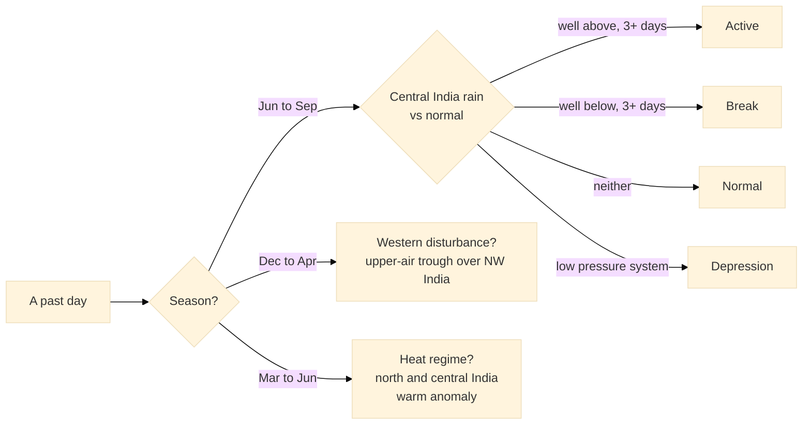

The labels must be usable **at the moment of forecasting**, so we use either the regime on the day the forecast was issued, or the regime the models themselves predict. We never use the true regime of the day being forecast, because that would sneak the answer in.

The sentence: *"Weights change with the weather, because the best model in a wet spell is not the best in a dry one."*

### 4.4 Piece 3: the skill memory

We store, for every model, place, lead, season and regime, **how large its recent error has been** and how many cases that is based on. Small samples are pulled toward the season average so the weights are not noisy.

The sentence: *"The system keeps a report card for every model, for every situation."*

### 4.5 Piece 4: the ladder of methods

We do not start with a giant neural network. We start with the simplest method and only move up when the next step **beats the one below on a year it has not seen**.

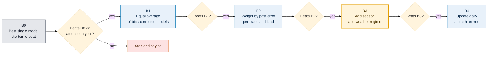

The weight for a model is proportional to `1 / error²` in that situation, then scaled so all weights sum to 1. A model with half the error gets four times the weight. A forecaster can check it by hand.

**B3 is our core claim**, because it is the step that satisfies "season and weather regime". **B2 is close to what IMD's ensemble does**, so the gap between B2 and B3 is our contribution over the existing practice.

The sentence: *"Every rung has to earn its place on unseen data, so every weight can be explained."*

### 4.6 Piece 5: extreme weather

Averaging smooths peaks. Blend two forecasts of 90 mm and 30 mm and you get 60 mm, which misses the extreme. So extremes are **not** read off the blended average. Instead:

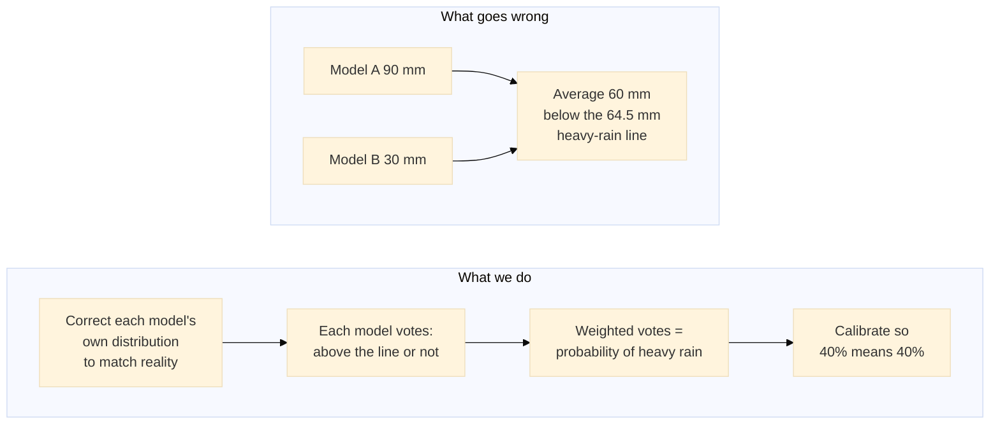

Thresholds: heavy rain at 64.5 mm per 24 h (also 115.6 and 204.5), heat wave by the IMD rule, high wind at 15 m/s (our stated choice). Checked with POD, FAR, CSI, FSS and a reliability diagram.

The sentence: *"We give the chance of heavy rain, not a smoothed average that hides it."*

### 4.7 Piece 6: proving it (the part judges care about most)

Grading a forecast on the same years it learned from is cheating. We hold a whole year out and repeat.

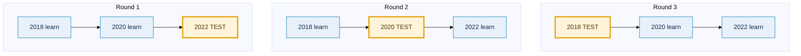

This is called **leave-one-year-out**. Gains are reported with a **95% confidence interval** from resampling blocks of 5 days (consecutive days are alike, so resampling single days would overstate certainty). A gain is claimed only when the interval excludes zero.

We also break the results down by region, regime and lead time. That breakdown shows *where* the weights earn their keep.

The sentence: *"Every year takes a turn as the exam. We never grade on what we studied."*

### 4.8 Piece 7: the daily run and the dashboard

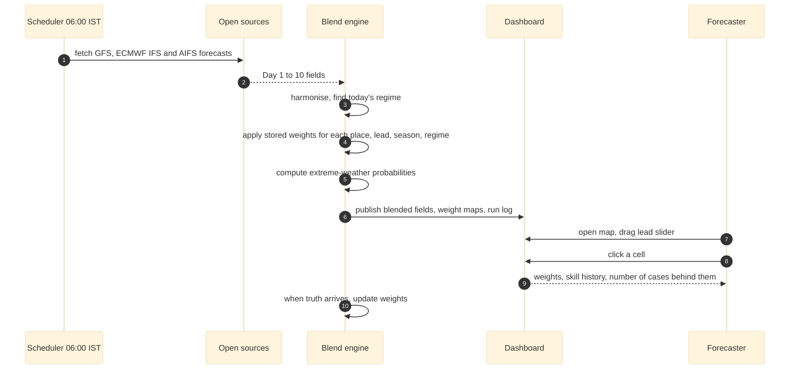

Six screens: Forecast, Weights, Skill, Extremes, Cell inspector, Run log. The **cell inspector** is the trust feature: click any square and see *why* the weights are what they are.

An honest catch that the deck does not hide: the models in the daily run are not exactly the ones the weights were learned on. ECMWF's open IFS matches HRES, so its weights carry over. AIFS and GFS start with equal weight and adjust as truth arrives.

### 4.9 The bridge to India's own models

NCUM and NEPS-G are not public. We build an **adapter**: a small piece of code that reads their file format so they can be plugged in as extra models. It is tested on GFS files (same format family). The deck says "adapter ready, needs NCMRWF data to learn its weights". It never says "tested on NCUM".

### 4.10 Which models can be blended for what (verified on 28 Sep)

This looks technical, and it matters, because it stops us promising something impossible.

| Model | Family | Years available | Days ahead | Has rain | Has temperature, wind, pressure |
|---|---|---|---|---|---|
| IFS HRES | Physics | 2016 to 2022 | 0 to 10 | **Yes** | Yes |
| GraphCast | AI | 2018, 2020, 2022 | 1 to 10 | **Yes** | Yes |
| Pangu-Weather | AI | 2018 to 2022 | 1 to 10 | **No** | Yes |
| FuXi | AI | 2020 | to 15 | **Yes** | Yes |
| GenCast (mean) | AI ensemble | 2020 | to 15 | **Yes** | Yes |
| Aurora | AI | 2022 | 10 | **No** | Yes |

Three consequences for the slides:

1. **Rain blends only four models** (HRES, GraphCast, FuXi, GenCast). Pangu and Aurora join for temperature, wind and pressure only. Never write a rain weight for Pangu.
2. **The main test uses three models over three years** (HRES + GraphCast + Pangu, leave-one-year-out). The five-model set is tested only inside 2020.
3. All models share **Day 1 to Day 10**.

### 4.11 What makes this different (say only these)

| Point | Meaning |
|---|---|
| **Physics and AI in one blend** | Weighted square by square |
| **Regime-aware weights** | Active, break, depression, western disturbance, heat |
| **Adapts daily** | Weights update as new truth arrives |
| **Extremes as calibrated probabilities** | Not a smoothed average |
| **Explainable** | Click any square, see the reasons |
| **NCUM-ready** | Open data today, India's model via an adapter |

Do not say "first", "novel", "state of the art" or "world's first". Blending is a known idea, and the judges know the literature. We win on the combination, the measurement and the honesty.

---

## 5. Real, planned, forbidden

### 5.1 Where we are on 29 Sep

| Item | State |
|---|---|
| Code for 26081 | **None yet.** `081/` holds only documents |
| Data | **Public and verified reachable** (WeatherBench2, CHIRPS, GFS, ECMWF open data) |
| Any measured result | **None yet.** A small first run (temperature and wind, three models, Day 3) is planned before the deadline. If it finishes, it gives the deck one true line |
| Dashboard | **Not built.** The SatQuery web app is the pattern to copy |
| NCUM / NEPS-G | **Not public.** Adapter only |

### 5.2 Traffic-light rules

| Colour | Rule | Examples |
|---|---|---|
| **Green** | A fact about the world or the data, checked | Models disagree. IMD's blend dates from 2008. The data is public. Rain is available from four models only |
| **Amber** | A plan. Write it as a plan | "The system will…", "designed to…", "planned" |
| **Red** | Never on a slide | "Improves accuracy by 25%" (no such number exists). "Tested on NCUM". "Beats IMD's operational forecast". "Real-time GraphCast" (only IFS, AIFS and GFS are open daily). Rain weights for Pangu. Any number from memory |

### 5.3 The one number

If the small first run completes, the model team gives you **one line** in this exact form:

> *"2 m temperature, Day 3: best single model X K → blend Y K RMSE (−Z%, 95% CI [a, b]); leave-one-year-out 2018 / 2020 / 2022, HRES + GraphCast + Pangu."*

Use it word for word on slide 4. If the blend only **matches** the best model, the line becomes: *"Blend matches the best single model on 2 m temperature at Day 3; regime weights under test."* That is still a good slide. If nothing arrives, slide 4 says what will be measured and how. Never round a number up, and never replace it with a target.

---

## 6. Lessons from the winning decks

Two SIH 2025 winning decks sit in `extra/templates-and-examples/`. Both are 6 slides on the same template. I read them slide by slide.

| Deck | Problem | What it did well |
|---|---|---|
| **Visioncraft**, PS25159 | Real-time phishing detection | One hero graphic on slide 2. A large branching flowchart on slide 3. A colour-coded challenge and strategy grid |
| **Niet SafeSecure**, PS25070 | Secure data wiping for recycled IT | A named product (EcoWipe) with a tagline. Real human quotes for the problem. A three-lane flowchart split by scenario. A tick-and-cross comparison table |

### 6.1 Patterns worth copying

| Pattern | Where they used it | Our version |
|---|---|---|
| **A product name and tagline** on slide 2 | "EcoWipe: Secure Wiping for Every Device" | A short name with "Right model, right place, right weather" |
| **Problem, Solution, Unique value** as three short blocks | Both slide 2s | The Problem / Our solution / Innovation stack in section 8 |
| **Key words in a highlight colour** inside plain sentences | Visioncraft, red words in grey pills | Highlight 2 to 4 words per bullet in one accent colour |
| **One hero image** that summarises the idea | Shield with icons around it; laptop and USB photos | The dominant-model map or the five-friends picture |
| **A decision diamond at the top of the flowchart** | "Device working or dead?" splitting into three lanes | The ladder gates ("beats the rung below?") |
| **Colour-coded lanes** | Orange, blue, green modes | One colour per model family, used everywhere |
| **Icons on every box** | Both flowcharts | One icon set only (see Part 7) |
| **Time and success figures on a scenario card** | "5 to 10 minutes, 95%+" | Not for us unless measured. We use "Day 1 to 10" and "one daily job" |
| **Challenge / risk / strategy as three coloured columns** | Visioncraft slide 4 | Same layout for the risk table |
| **Risk and mitigation as a pair** | Niet slide 4 | One line each |
| **Existing solution vs ours, with tick and cross** | Niet slide 5 | Single model vs IMD's blend vs ours |
| **Prototype link and video link** on slide 3 | Visioncraft | Only if it exists (Part 9) |
| **Sources listed, brief** | Both slide 6s | A numbered reference list |

### 6.2 Things they did that we will not copy

| They did | Why not |
|---|---|
| Very small text, some of it about 9 pt | Judges skim dozens of decks. We use 16 pt body and 12 pt minimum |
| Large unsourced numbers ("₹50,000 Cr", "25x ROI", "25,000+ jobs") | A weather judge will ask where they came from. We use a number only with its source or measurement |
| "World's first" claims | Unverifiable, and a scientist will challenge it |
| Stock photos with no meaning | Every picture we use carries information |
| A text wall on slide 5 | Cards and a table instead |
| A tick against every row of the comparison table | We include a row where we do not win, or a "partial" mark, which makes the rest believable |

### 6.3 What they teach about judging

Both winning decks answer the judges' three silent questions on the first two slides: *what is the problem, what do you do, why is it different*. The technical slide is a diagram, not text. The feasibility slide names risks. That is the shape to follow.

---

## 7. Visual system

The template is fixed (13.33 × 7.5 inch, 16:9, Calibri, blue footer bar, team name top-left, SIH logo top-right). Inside it, we set our own visual language.

### 7.1 Palette

Colours that a colour-blind reader can tell apart (the Okabe–Ito set).

| Use | Name | Hex |
|---|---|---|
| **IFS HRES** (physics) | Blue | `#0072B2` |
| **GraphCast** (AI) | Orange | `#E69F00` |
| **Pangu-Weather** (AI) | Green | `#009E73` |
| **FuXi** (AI) | Pink | `#CC79A7` |
| **GenCast** (AI ensemble) | Vermilion | `#D55E00` |
| Text | Ink | `#14213D` |
| Soft backgrounds | Pale blue / cream | `#E8F1FA` / `#FFF4DA` |
| Warning / stop | Pale red | `#FDE2E2` |
| Neutral | Grey | `#6B7280` |

**One rule:** each model has one colour on every slide, chart and legend. After two slides, the eye learns it and no legend is needed.

Highlight colour for key words in text: `#D55E00`. Use it on at most 2 to 4 words per bullet.

### 7.2 Type and space

| Element | Size |
|---|---|
| Slide title (from the template) | Leave as is |
| Block headings | 20 to 24 pt bold |
| Body | **16 pt**, never below 14 pt |
| Table cells, diagram labels | 12 to 14 pt, never below 12 |
| Reference list | 12 pt |
| Words per slide, outside diagrams | **60 to 80** |
| Margins | 0.5 inch, clear of the logo and footer |

Font: Calibri (template). Numbers in bold. Do not add a second typeface.

### 7.3 Icon set

Choose **one** style and stay with it. Free options: Lucide (`lucide.dev`, MIT licence), Phosphor (`phosphoricons.com`, MIT), Material Symbols (Apache 2.0). Icons to gather:

| Idea | Icon |
|---|---|
| Physics model | server / cpu |
| AI model | brain-circuit / sparkles |
| Ensemble | layers |
| Truth | check-circle |
| Region | map |
| Lead time | clock |
| Season | calendar |
| Regime | cloud-rain / wind |
| Weight | scale |
| Extreme | alert-triangle |
| Heat wave | thermometer-sun |
| Rain | cloud-rain-wind |
| Verification | bar-chart / shield-check |
| Daily run | refresh-cw |
| Dashboard | layout-dashboard |
| User | user |

### 7.4 Rendering the Mermaid diagrams in this guide

Every diagram here is Mermaid. Three ways to turn them into slide art.

1. **Quickest:** open the file on GitHub. Mermaid renders in the page. Screenshot at high zoom.
2. **Best for the deck:** paste a block into <https://mermaid.live>, adjust, and **export SVG**. Insert the SVG into PowerPoint or Google Slides, where it stays sharp and you can recolour it.
3. **All at once**, on a machine with Node: `npx -p @mermaid-js/mermaid-cli mmdc -i 081/PPT_TEAM_GUIDE.md -o shots/ppt.svg` renders every block in numbered files.

Tips:

- The first line (`%%{init: …}%%`) sets fonts and colours. Leave it in.
- Use `flowchart LR` (left to right) for wide slide areas. Use `TB` for tall ones.
- If a diagram is too dense for a slide, cut boxes rather than shrinking text.
- After export, redraw the icons on top (Part 7.3). Plain boxes are fine as a first version.

### 7.5 Real images we can use

| Image | Source | Status |
|---|---|---|
| **Dominant-model map** (a map of India where each square is coloured by the model with the highest weight, Day 3) | Model team's first run | Waiting on the first run. If no run: use the five-friends diagram instead. **Never** mock a map with invented data |
| **Dashboard screenshot** | Field Atlas shell copied from `167/web`, filled with real output | Not built yet |
| **Weight-map panel row** (one small map per model) | Same run | Waiting |
| **Scorecard table** | Same run | Waiting |
| Mermaid diagrams | This guide | Ready |

Any picture that is not real output must say **"illustrative"** on it, in small text.

---

## 8. The deck, slide by slide

**Template rules.** Six slides at most, **including the title**. Use the official template. Keep its headings unchanged and in order. Points, diagrams, infographics and pictures, not paragraphs. **PDF only.** Delete the "Important Pointers" slide before export.

**Who judges.** Likely atmospheric scientists from NCMRWF and IMD. They reward a named baseline, real verification numbers, honest limits and knowledge of Indian weather.

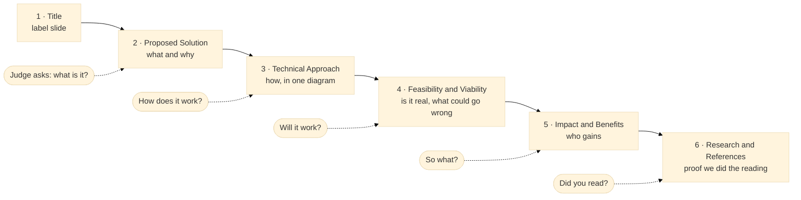

Every slide below has: the goal, the wireframe, the text to paste, the diagrams, the assets, speaker notes, and the two lists that keep you safe (*can change*, *risky*). Text in **[brackets]** is filled in on the day.

---

### Slide 1 — Title

**Goal:** identify the entry without error. Nothing else.

| Field | Content |
|---|---|
| Problem Statement ID | 26081 |
| Problem Statement Title | Hybrid AI–NWP Multi-Model Forecast Blending System |
| Theme | Miscellaneous |
| PS Category | Software |
| Team ID | **[copy from the portal]** |
| Team Name | **[exactly as registered]** |

**Optional under the title:** product name and tagline, for example **"Regime-aware blending: right model, right place, right weather."**

**Wireframe**

```
┌───────────────────────────────────────────────────────────────────────┐
│ Team name                                               [SIH 2026 logo]│
│                                                                       │
│                     SMART INDIA HACKATHON 2026                        │
│                                                                       │
│   Problem Statement ID –  26081                                       │
│   Problem Statement Title – Hybrid AI–NWP Multi-Model Forecast        │
│                              Blending System                          │
│   Theme – Miscellaneous          PS Category – Software               │
│   Team ID – [ ]                  Team Name – [ ]                      │
│                                                                       │
│   ░░░░ faded map of India, 5-colour dominant-model pattern ░░░░       │
└───────────────────────────────────────────────────────────────────────┘
```

**Visual:** the dominant-model map, faded to 15% opacity as a background. If no real map exists, use a plain background. A fake one is worse than none.

**Can change:** tagline, background. **Risky:** any mismatch with the portal (ID, theme, category). It can get the entry screened out. Copy from the portal page, do not retype.

---

### Slide 2 — Proposed Solution

**Goal:** in ten seconds a judge knows the problem, our answer and why it is different. This is the slide most judges read closely.

The template asks for: the detailed explanation, how it addresses the problem, and the innovation and uniqueness.

**Wireframe** (three stacked blocks on the left, one hero on the right, like both winners)

```
┌───────────────────────────────────────────────────────────────────────┐
│ Team name              [PRODUCT NAME] — tagline               [SIH]   │
│ Proposed Solution                                                      │
│ ┌───────────────────────────────────────┐ ┌─────────────────────────┐ │
│ │ THE PROBLEM   (pale red pill)         │ │                         │ │
│ │  • …two bullets…                      │ │   HERO VISUAL           │ │
│ ├───────────────────────────────────────┤ │   five models →         │ │
│ │ OUR SOLUTION  (pale blue pill)        │ │   weights → one         │ │
│ │  • …three bullets…                    │ │   forecast              │ │
│ ├───────────────────────────────────────┤ │   + dominant-model map  │ │
│ │ WHAT IS NEW   (pale yellow pill)      │ │                         │ │
│ │  • …four bullets…                     │ │   6 output icons below  │ │
│ └───────────────────────────────────────┘ └─────────────────────────┘ │
└───────────────────────────────────────────────────────────────────────┘
```

**Ready-to-paste text**

**THE PROBLEM**
- No forecast model is best everywhere. Physics models and AI models win in **different regions, seasons, lead times and monsoon phases**.
- Forecasters reconcile them by experience. IMD's blend (2008) mixes **physics models only, with fixed weights**.

**OUR SOLUTION**
- A blending engine that learns from past errors **how much to trust each model** for this square, this many days ahead, this season, this weather regime.
- **Outputs:** blended rain, temperature and wind (Day 1 to 10) · weight maps · scorecard against every model · heavy-rain, heat-wave and high-wind probabilities · a daily automated run with a dashboard.

**WHAT IS NEW**
- **Physics and AI in one blend**, weighted square by square.
- **Regime-aware weights**: active, break, depression, western disturbance, heat.
- **Extremes as calibrated probabilities**, not a smoothed average.
- **Explainable**: click any square to see why its weights are what they are.
- **NCUM-ready** through an adapter.

**Hero visual** (right side). Two choices, in order of preference:

1. **Dominant-model map** of India for Day 3, coloured by which model has the most weight, with a five-colour legend. *Only from the real run.*
2. **The five-friends diagram** (Part 1.1) redrawn with model icons. Mark it "illustrative".

Under the hero, a row of **six small icons** for the outputs: blended forecast, weight map, scorecard, extreme probability, daily run, dashboard.

**Diagram for the hero (fallback), ready to paste into mermaid.live**

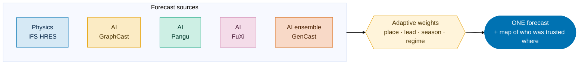

**Speaker notes (about 45 seconds)**
"Every morning a forecaster looks at five models that disagree. IMD already blends physics models with fixed weights, and that was a good idea in 2008. We add the AI models and let the weights change with the weather, because the model that wins in an active monsoon spell is not the one that wins in a break. This map shows which model the system trusts most, square by square, on Day 3."

**Can change:** the product name, which bullets lead, the hero.
**Risky:** saying "replaces the NCMRWF forecast" (say *assists forecasters*). Calling IMD's blend "old" or "wrong". Listing Pangu for rain. Writing "first" or "novel".

---

### Slide 3 — Technical Approach

**Goal:** show the method as **one picture** that a scientist can read in 20 seconds and find no hole in. This slide won both reference decks. It is a diagram, not text.

The template asks for: technologies, and methodology and process (flow chart, images, working prototype).

**Wireframe**

```
┌───────────────────────────────────────────────────────────────────────┐
│ Team name                TECHNICAL APPROACH                     [SIH]  │
│ ┌────────────┐ ┌───────────────────────────────────────────────────┐ │
│ │Tech stack  │ │  BIG FLOWCHART, left to right, six coloured lanes  │ │
│ │(icon strip)│ │  Inputs → Prepare → Learn → Blend → Prove → Deliver│ │
│ │ Data       │ │        with the ladder gate ◇ and the held-out     │ │
│ │ Process    │ │        test called out in orange                   │ │
│ │ Blend / ML │ └───────────────────────────────────────────────────┘ │
│ │ Verify     │ ┌──────────────────────┐ ┌──────────────────────────┐ │
│ │ App        │ │ Ladder B0→B4 strip   │ │ Prototype: [link]  Video: │ │
│ └────────────┘ └──────────────────────┘ │ [link]  (only if real)   │ │
│                                          └──────────────────────────┘ │
└───────────────────────────────────────────────────────────────────────┘
```

**Left column: technologies (icons plus short names)**

| Layer | Tools |
|---|---|
| Data | WeatherBench2 (ERA5, IFS HRES, GraphCast, Pangu, FuXi, GenCast) · CHIRPS · NOAA GFS · ECMWF open data |
| Processing | Python · xarray · zarr · NumPy · xesmf |
| Blend and ML | Inverse-error weighting · daily online update · LightGBM stacking (optional) · isotonic calibration |
| Verification | RMSE · ACC · CSI · ETS · FSS · Brier · bootstrap confidence intervals |
| App | FastAPI · React · MapLibre · scheduled daily job |

**Centre: the main flowchart** (use this; export as SVG and colour-code the lanes)

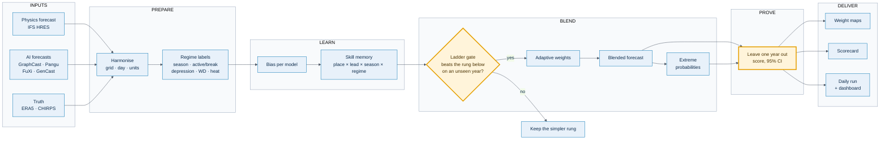

**Strip below: the ladder** (small, one row)

`B0 best single model` → `B1 equal average` → `B2 weight by past error` → `B3 + season and regime` → `B4 + daily update`
*Each step ships only if it beats the previous one on a year the weights never saw.*

**Prototype box** (bottom right): follows the winners. **Fill only if real**: a GitHub link and a short demo video. See Part 9.

**Speaker notes (about 45 seconds)**
"We start simple on purpose. Every rung of the ladder has to beat the one below on a year the weights never saw. That keeps every weight explainable to a forecaster, and it means our numbers are measured, not tuned. The two orange boxes are where we guard against fooling ourselves: the gate, and the held-out test."

**Can change:** library names, diagram style, icons.
**Risky:** drawing a deep neural network as the core (the data cannot support it and the weights become unexplainable). Leaving verification out of the flow, since judges look for it. An arrow from truth into the weights of a scored forecast (looks like leakage).

---

### Slide 4 — Feasibility and Viability

**Goal:** show the idea is real, name what can go wrong, and show we have an answer for each. Winners used a three-column grid. We add one measured line and a risk map.

The template asks for: the feasibility analysis, challenges and risks, strategies for overcoming them.

**Wireframe**

```
┌───────────────────────────────────────────────────────────────────────┐
│ Team name           FEASIBILITY AND VIABILITY                    [SIH] │
│ ┌──────────────────────┐ ┌───────────────────────────────────────────┐│
│ │ FEASIBLE (green tick) │ │ CHALLENGE → STRATEGY  (3 coloured columns)││
│ │ • public data         │ │ ┌────────┬──────────────┬──────────────┐ ││
│ │ • laptop scale        │ │ │Challng │ Strategy     │ Status       │ ││
│ │ • MEASURED LINE ★     │ │ │ ×5 rows                              │ ││
│ └──────────────────────┘ │ └────────┴──────────────┴──────────────┘ ││
│ ┌──────────────────────┐ └───────────────────────────────────────────┘│
│ │ RISK MAP (quadrant)   │ ┌───────────────────────────────────────────┐│
│ │                       │ │ VIABILITY: Technical · Economic · Ops     ││
│ └──────────────────────┘ └───────────────────────────────────────────┘│
└───────────────────────────────────────────────────────────────────────┘
```

**FEASIBILITY**
- All inputs are **public and free**: WeatherBench2, CHIRPS, NOAA GFS, ECMWF open data. No login.
- Runs on a **laptop at 1.5°**; the fine 0.25° grid on free Kaggle or Colab. No deep-network training.
- **MEASURED:** **[the line from Part 5.3, copied word for word, with its caveat. If none arrived, use: "First held-out result is produced by the same pipeline; the leave-one-year-out test is fixed in advance."]**

**CHALLENGES → STRATEGIES**

| Challenge | Strategy |
|---|---|
| NCUM and NEPS-G are not public | Adapter to the same interface, tested on GFS files; weights learn quickly once NCMRWF provides data |
| AI models overlap only in 2020 | Three-model set for multi-year tests; five-model set tested within 2020 |
| Blending smooths heavy rain | Calibrated exceedance probabilities |
| Live models are not the training models | Start from equal weight, update online |
| Rain truth quality | CHIRPS, not reanalysis; IMD gridded rain when available |

**VIABILITY**
- **Technical:** open-source stack, every step measurable.
- **Economic:** no licence cost; runs beside the current ensemble workflow on ordinary hardware.
- **Operational:** one daily job; fits alongside IMD's blend.

**Risk map** (a picture: how likely, how much it hurts). Placement is the team's judgement, and the slide should say so.

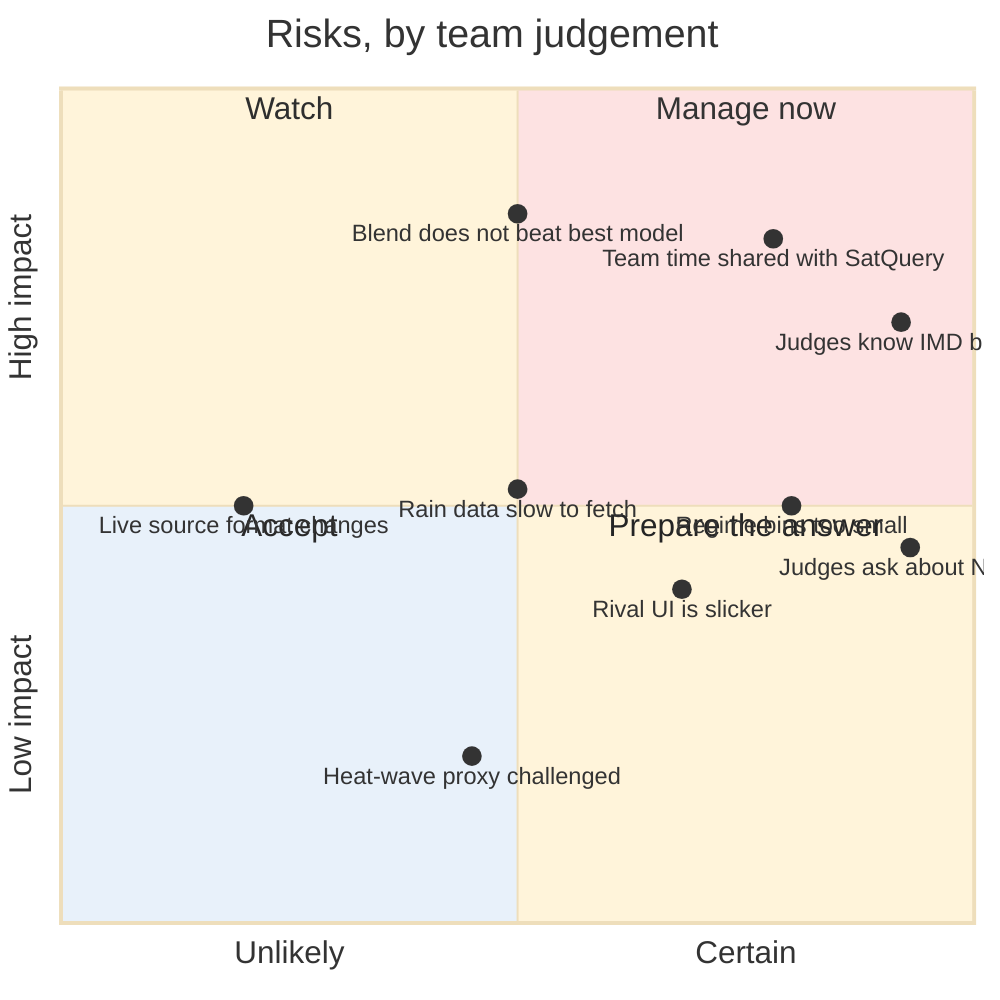

*If the quadrant chart is too heavy on the slide, use the table and keep this for the appendix or the video.*

**Speaker notes (about 40 seconds).** "Everything we need is public and small. The hardest parts are not compute. They are that AI models only overlap in one year, and that we cannot see NCUM. So we test with the years we have, in three folds, and we built the adapter so NCMRWF's model plugs in the day they give us data." Then read the measured line exactly.

**Can change:** the table rows (keep at least four), the risk placement. **Risky:** replacing the measured line with a target, rounding it up, hiding a "no gain" result, claiming zero risk.

---

### Slide 5 — Impact and Benefits

**Goal:** show who gains and why this beats what exists. Use cards and a comparison table, not a text wall. The winners used both. We keep the numbers honest.

The template asks for: the impact on the target audience, and the benefits (social, economic, environmental, etc.).

**Wireframe**

```
┌───────────────────────────────────────────────────────────────────────┐
│ Team name              IMPACT AND BENEFITS                       [SIH] │
│ ┌─────────────────────────────┐ ┌─────────────────────────────────┐   │
│ │ WHO BENEFITS (5 icon cards) │ │ BENEFITS: Social · Economic ·    │   │
│ │ forecaster · disaster mgr · │ │ Environmental · Governance       │   │
│ │ agromet · grid · research   │ │ (four icon tiles, one line each) │   │
│ └─────────────────────────────┘ └─────────────────────────────────┘   │
│ ┌───────────────────────────────────────────────────────────────────┐ │
│ │ COMPARISON  Single model │ IMD blend (2008) │ Ours   ✓ ✗ ◐           │ │
│ └───────────────────────────────────────────────────────────────────┘ │
│ ┌─────────────────────────────────┐                                   │
│ │ Forecaster's morning (journey)  │  (optional, small)                │ │
│ └─────────────────────────────────┘                                   │
└───────────────────────────────────────────────────────────────────────┘
```

**WHO BENEFITS**
- **NCMRWF and IMD forecasters:** one best-estimate forecast, with the reason for each weight.
- **State disaster management authorities:** earlier, calibrated heavy-rain and heat-wave signals.
- **Agro-met advisory units (Gramin Krishi Mausam Sewa):** better rain and temperature inputs for farm advisories.
- **Power-grid planners:** temperature for demand, wind for generation.
- **Researchers:** a live Indian scorecard of AI against physics models.

**BENEFITS**
- **Social:** better-targeted warnings for heavy rain and heat waves.
- **Economic:** more value from forecasts already produced; no licence cost.
- **Environmental:** better wind and temperature forecasts help renewable-energy scheduling.
- **Governance:** every weight traceable to measured skill, so it is auditable.

**COMPARISON**

| Capability | One model | IMD blend (2008) | Ours |
|---|---|---|---|
| Uses AI weather models | ◐ | ✗ | ✓ |
| Weights by region and lead time | ✗ | ✓ | ✓ |
| Weights by season and weather regime | ✗ | ✗ | ✓ |
| Updates weights daily | ✗ | ✗ | ✓ |
| Extremes as calibrated probabilities | ✗ | ✗ | ✓ |
| Weight maps shown to forecasters | ✗ | ✗ | ✓ |
| **Tested on NCMRWF's own models** | ✗ | ✓ | **✗ not yet** |

The last row is deliberate. A table where we win everywhere looks like marketing. One honest cross builds trust in the rest. *Check the IMD column against the papers on slide 6 before printing.*

**Optional visual: a forecaster's morning**

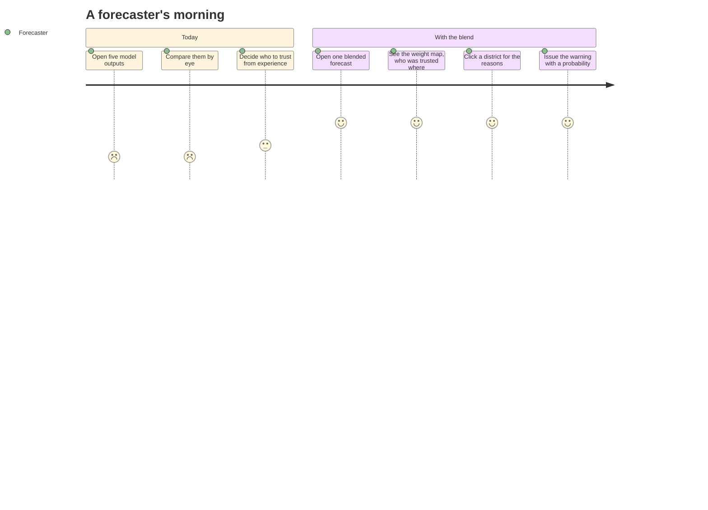

*Scores are a feeling, not data. Label it as a story.*

**Numbers.** A figure such as "lives saved" or "₹ crore lost to floods" is fine **only with a source printed on slide 6**. The winners used large market numbers; we use a number only if we can link it. One real, cited figure is better than four uncited ones. If you cannot find one in time, use none.

**Speaker notes (about 30 seconds).** "The person who acts on the forecast is a duty officer, not a modeller. What they need is one forecast, a chance of heavy rain, and a reason. The table shows what exists today. Notice the last row: we have not yet run on NCUM, and we say so."

**Can change:** audiences, benefit wording, which visual. **Risky:** any figure without a source, "saves lives" in a headline, a table with only ticks.

---

### Slide 6 — Research and References

**Goal:** prove we did the reading. Short, exact, checked.

**Reference list**

1. SIH 2026, PS26081, MoES / NCMRWF, official problem statement.
2. Rasp et al., "WeatherBench 2: A benchmark for the next generation of data-driven global weather models," *JAMES*, 2024.
3. Lam et al., "Learning skillful medium-range global weather forecasting" (GraphCast), *Science*, 2023.
4. Bi et al., "Accurate medium-range global weather forecasting with 3D neural networks" (Pangu-Weather), *Nature*, 2023.
5. Chen et al., "FuXi: a cascade machine learning forecasting system for 15-day global weather forecast," *npj Climate and Atmospheric Science*, 2023.
6. Price et al., "Probabilistic weather forecasting with machine learning" (GenCast), *Nature*, 2025.
7. Roy Bhowmik and Durai, IMD multi-model ensemble for district rainfall, *J. Earth Syst. Sci.* and *Meteorol. Atmos. Phys.*
8. Krishnamurti et al., "Improved weather and seasonal climate forecasts from multimodel superensemble," *Science*, 1999.
9. Rajeevan, Gadgil and Bhate, "Active and break spells of the Indian summer monsoon," *J. Earth Syst. Sci.*, 2010.
10. Funk et al., CHIRPS, *Scientific Data*, 2015. Hersbach et al., ERA5, *QJRMS*, 2020.
11. Roberts and Lean, "Scale-selective verification of rainfall accumulations," *Mon. Wea. Rev.*, 2008.

**Boxes.** *Data:* WeatherBench2 (`gs://weatherbench2`) · CHIRPS (UCSB CHC) · NOAA GFS (AWS) · ECMWF open data. *Project:* GitHub and demo video, only if they exist.

**Wireframe:** a two-column numbered list at 12 pt on the left; a small "Data sources" box and a "Project links" box on the right. Short URLs, no long strings.

**Can change:** order, add papers. **Risky:** a wrong year or venue. NCMRWF judges know these papers. **Open every link and check every citation before export.**

---

## 9. Prototype link, video, QR

Both winners put a prototype link and a video link on the technical slide, and it is a good habit: it says "this is real".

| Item | Rule |
|---|---|
| **GitHub repository** | Link only if it holds working code for 26081. The folder today has only documents. Do not link an empty repo |
| **Demo video** | A 60 to 90 second screen recording of the dashboard on real output: Forecast screen, drag the lead slider, Weights screen, click a cell. No voice-over needed; captions on screen |
| **QR code** | Optional. Generate from the link. Test it on a phone before export |
| **If none exist by 30 Sep** | Omit the box. Do not write "coming soon" |

If a video is made later, keep its first 10 seconds as the strongest moment: the weight map appearing.

---

## 10. Judge questions

Answer in one or two sentences. If unsure, say so and say how you would find out.

| Question | Answer |
|---|---|
| Why not just use NCUM? | It is not public. The adapter is built to the same interface. With one or two seasons of NCUM output, the weights would learn in minutes. |
| Is your improvement statistically significant? | We test with a block bootstrap over held-out days and claim a gain only where the 95% interval excludes zero. |
| How is this different from IMD's multi-model ensemble? | It adds AI models, its weights change with season and weather regime and update daily, and extremes are calibrated probabilities. Its baseline is IMD's idea; our contribution is the step beyond. |
| Why verify rain on CHIRPS and not ERA5? | ERA5 rain is model output. CHIRPS combines satellite and gauges. IMD's own gridded rain would be better, and we will use it when we can download it. |
| Does ERA5 favour HRES? | Slightly, for temperature and wind, because ERA5 comes from the same system. We state it. Rain uses an independent truth. |
| Why not a deep neural network for the blend? | Only one year has all AI models overlapping, which is too little to train one honestly. Inverse-error weighting is near-optimal here and a forecaster can check it by hand. |
| Isn't averaging bad for extreme rain? | Yes, it smooths the peaks. That is why extremes come from calibrated probabilities, not the blended mean. |
| What if the blend does not beat the best model? | We would report where it matches, and where it wins by region and regime. The design tests each rung and stops when one does not help. |
| How do you handle a regime with few examples? | We pull its error estimate toward the season average, in proportion to how few cases there are. |
| Can it run live? | The daily run uses ECMWF open IFS, AIFS and GFS. GraphCast and Pangu are not served daily in the open, so they are not in the live run unless we run them ourselves on a GPU. |
| Is the heat-wave forecast real? | It uses 2 m temperature at 12 UTC (17:30 IST) as a proxy for the daily maximum, calibrated against truth. We state the proxy. |
| Which models do you blend for rain? | HRES, GraphCast, FuXi, GenCast. Pangu and Aurora do not publish rain in the public data. |
| What data did you train on? | Public: ECMWF and AI forecasts from WeatherBench2, ERA5 and CHIRPS. |
| Have you tested on NCMRWF data? | No. |
| What is your result? | **[The measured line, or:]** We fixed the test in advance and will report it whichever way it goes. |
| Who is the user? | Forecasters first; then disaster managers, agro-met units, grid planners. |
| What would you do with more time? | Learn weights on NCUM and NEPS-G. Add ensemble spread as a regime signal. District-level skill. |

---

## 11. Production plan and checklist

### 11.1 Who does what

| Task | Owner | Input |
|---|---|---|
| Copy the portal fields to slide 1 | PPT lead | Portal |
| Slide 2 hero visual | Designer | Dominant map, or Part 1.1 diagram |
| Slide 3 flowchart (SVG, coloured) | Designer | Part 8 mermaid |
| Slide 4 measured line | Model team | The first run |
| Slide 5 cited figure (or none) | Researcher | A source |
| Slide 6 verified references | Researcher | Part 8 list |
| Read every slide aloud, time it | Everyone | Speaker notes |
| Export PDF, re-open, read | PPT lead | |

### 11.2 Timeline

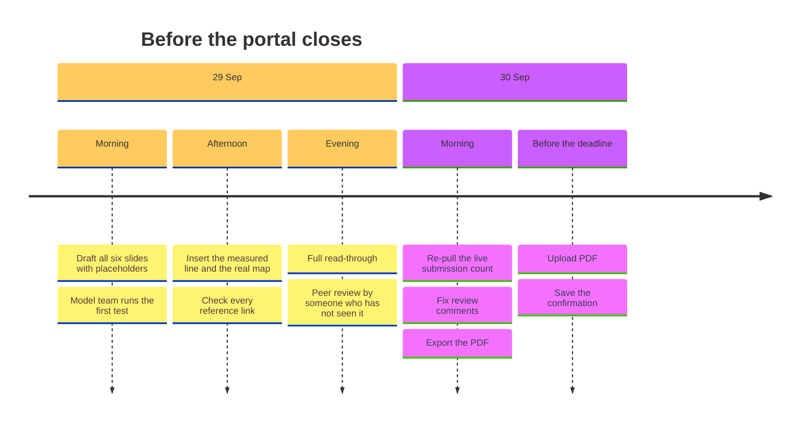

### 11.3 Final checklist

- [ ] Slide 1 matches the portal: PS ID 26081, theme, category, team ID, team name
- [ ] Six slides at most; template headings unchanged and in order
- [ ] "Important Pointers" slide removed
- [ ] Every number is measured, cited, or absent
- [ ] Slide 4 measured line copied word for word (or the honest alternative)
- [ ] No "first", "novel", "state of the art", "world's first"
- [ ] No claim of NCUM testing
- [ ] No rain weight for Pangu, Aurora or NeuralGCM
- [ ] Heat-wave text says the temperature is a proxy for the daily maximum
- [ ] IMD's blend shown as the baseline; the comparison table has one honest cross
- [ ] Each model has one colour everywhere
- [ ] Body text at least 14 pt, diagram labels at least 12 pt
- [ ] Any non-real picture says "illustrative"
- [ ] Every reference opened; year and venue checked
- [ ] PDF exported, re-opened, every slide read once, file size reasonable
- [ ] Someone outside the team read it and could say what it does in one sentence

---

## 12. Glossary

| Term | Plain meaning |
|---|---|
| **ACC** | Anomaly correlation: does the forecast get the pattern of ups and downs right? |
| **Adapter** | Code that reads another model's file format |
| **AIFS** | ECMWF's AI forecast model, open data |
| **Bias** | A model's average error |
| **Blending** | A weighted average of forecasts |
| **CHIRPS** | Public daily rainfall data from satellites and gauges |
| **CSI / ETS / POD / FAR / FSS** | Event-scoring metrics, see 2.7 |
| **Ensemble** | Many runs of one model to show uncertainty |
| **ERA5** | A best-estimate record of past weather |
| **GenCast** | An AI ensemble forecast model |
| **GFS** | NOAA's physics model, open data |
| **GraphCast** | Google DeepMind's AI weather model |
| **Grid** | The chessboard a model forecasts on |
| **HRES** | ECMWF's high-resolution physics model |
| **IMD** | India Meteorological Department |
| **JJAS** | June to September, the monsoon season |
| **Lead time** | How many days ahead the forecast looks |
| **Leakage** | Letting the answer into the learning stage |
| **LOYO** | Leave-one-year-out testing |
| **NCMRWF** | National Centre for Medium Range Weather Forecasting |
| **NCUM** | NCMRWF's own physics model, 12 km |
| **NEPS-G** | NCMRWF's ensemble, 23 members |
| **NWP** | Numerical weather prediction, the physics-based forecast |
| **Out-of-sample** | Scored on data not used for learning |
| **Regime** | A recurring weather pattern (active, break, depression…) |
| **RMSE** | Root mean square error |
| **Skill** | How good a forecast is against a reference |
| **Truth** | The best record of what actually happened |
| **Valid time** | The moment a forecast is about |
| **Weight map** | A map of how much each model is trusted in each square |
| **WeatherBench2** | A public benchmark and data store for weather models |
| **Western disturbance** | A winter and spring system from the west |

---

Related: [`WORKFLOW_AND_DECK.md`](WORKFLOW_AND_DECK.md) (the technical workflow behind this guide) · [`../080/PPT_TEAM_GUIDE.md`](../080/PPT_TEAM_GUIDE.md) (sibling idea, shares most of the data) · winning decks in [`../extra/templates-and-examples/`](../extra/templates-and-examples/).
