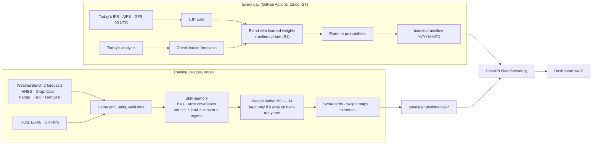

# Samanvay — hybrid AI–NWP forecast blending for India (PS26081)

Samanvay blends physics weather models (ECMWF IFS / HRES, NOAA GFS) with AI weather models (GraphCast, Pangu,
FuXi, GenCast, AIFS). Weights adapt per grid cell, lead time, season and weather regime, and are learned from
each model's past errors. The output is one blended forecast for rain, temperature, wind and pressure,
probabilities of extreme weather, weight maps, and a dashboard that updates every day.

Problem statement: SIH 2026 · PS26081 · MoES / NCMRWF.

## Measured results

Held-out verification: each year is scored with weights trained on the other years. WeatherBench 2 forecasts,
1.5° India box, 00 UTC. Truth is ERA5, and CHIRPS for rain.

| Day 3, blend vs best single model | 3 models, 2018 / 2020 / 2022 (1,095 days) | 5 models, 2020 |
|---|---|---|
| Temperature (2 m) | **−4.8 %** RMSE | **−8.3 %** |
| Wind (10 m) | **−9.7 %** | **−3.4 %** |
| Sea-level pressure | **−6.2 %** | **−12.6 %** |
| Rain (24 h) | **−4.0 %** (level with the bias-corrected best model) | **−4.1 %** |

All gains have 95 % block-bootstrap confidence intervals that exclude 0. The gain grows with lead time: at
Day 10, temperature is −15 % and pressure −13 %.

Extreme events (top 5 % per cell), probability skill vs climatology: temperature +0.50, wind +0.48,
rain +0.17 (Brier skill score).

Honest findings:
- Regime-conditioned weights (monsoon active / break, depression, western disturbance, heat) change the weights
  but do not lower RMSE further.
- For average rain, most of the gain comes from bias correction. The blend adds more on extreme-rain
  probabilities.

Full tables: `TASK.md`. Method: `MODEL_SPEC_81.md`.

## How it works



## Run it

**Dashboard with real data (Windows PowerShell), from the repo folder:**
```
.\start.ps1
```
This installs what is missing, starts the API on port 8081 and the dashboard on port 5181, and opens the browser.
The bottom bar should read **ENGINE CONNECTED**.

Manual equivalent:
```
pip install -r requirements-server.txt
$env:BLEND_BUNDLES="bundles"; uvicorn blend.server:app --port 8081
cd web; npm install; npm run dev          # second terminal -> http://127.0.0.1:5181
```

**Today's live forecast** (after ~09:00 UTC, when ECMWF's 00 UTC run is complete):
```
pip install -r requirements-live.txt
python -m blend.live run --bundles bundles
```
GitHub Actions (`.github/workflows/live-run.yml`) runs this every day at 09:30 UTC and commits the new bundle.

With NCMRWF's own models (GRIB2 files of the same 00 UTC run; not public):
```
python -m blend.live run --bundles bundles --ncum /data/ncum/2026093000 --nepsg /data/nepsg/2026093000
```

**Products** (with the API running): `/api/export/geojson?run=<id>[&lead=<day>]` (grid cells with blended values,
dominant model and extreme probabilities), `/api/export/csv?run=<id>` (state table). NetCDF of a whole run:
`python -m blend.deliver <run id>`. The Run log screen links the first two.

**One-off static files** (already in `models/`; rebuild only if the grid changes, needs `zarr` + `gcsfs`):
```
python -m blend.heatwave build-static        # models/live_static.nc: ERA5 12 UTC normals, orography, land-sea mask
python -m blend.live_regime build-clim       # models/live_regime.nc: ERA5 regime indices 2003-2017
```

**Training** (Kaggle, CPU, Internet on): see `KAGGLE_GUIDE.md`. One cell:
```
!git clone -q https://github.com/shreyashsri79/081 && cd 081 && pip install -q gcsfs "zarr>=2.18,<3" && python run_all.py
```
After training, rebuild the live model file, including the extreme-event tables:
```
python -m blend.live build-model --art /kaggle/working/artifacts --cache /kaggle/working/cache
```

## Repository

| Path | What |
|---|---|
| `blend/` | Engine: `sources` (WB2 ingest), `harmonise`, `chirps`, `regimes`, `skill`, `weights`, `verify`, `extremes`, `live`, `heatwave`, `live_regime`, `adapters` (NCUM / NEPS-G), `export`, `deliver` (GeoJSON / CSV / NetCDF), `server` |
| `run_all.py` | Training + held-out verification + dashboard bundles, one command |
| `models/live_model.nc` | Learned covariance, bias and extreme tables used by the live run |
| `models/live_state.nc` | Online (B4) error statistics, updated by every live run |
| `models/live_static.nc` | ERA5 1990–2019 normal 12 UTC temperature, orography, land-sea mask (heat-wave rule) |
| `models/live_regime.nc` | ERA5 regime indices 2003–2017 (live regime label) |
| `bundles/` | Runs served to the dashboard: 12 hindcasts + the last 10 live days; `live_verification.json` |
| `web/` | React + MapLibre dashboard |
| `notebooks/` | Step-by-step Kaggle notebooks (same code as `run_all.py`) |

## Limits (also stated in every live bundle)

- The live models are not the training models. IFS borrows HRES's learned skill and AIFS borrows GraphCast's.
  GFS has no training counterpart and earns weight only as its own verified days accumulate.
- Live verification uses the IFS analysis as truth, which favours IFS. Hindcast scores use ERA5 / CHIRPS.
- The grid is 1.5° (~167 km cells). IMD point thresholds (e.g. 64.5 mm) therefore become per-cell percentiles.
- Heat wave (live runs only): the IMD rule is applied per cell to 12 UTC (17:30 IST) 2 m temperature against ERA5
  12 UTC normals. A cell mean at 17:30 IST runs below a station's maximum, so the absolute thresholds (40 / 45 /
  47 °C) trigger less often than at stations. The probability is uncalibrated: training holds no afternoon truth.
- The live regime label uses proxies (yesterday's Day-1 forecast for "observed" rain and afternoon temperature);
  weights do not depend on it.
- NCUM / NEPS-G are not public. The adapter is tested on generated GRIB2 files, not on NCMRWF output; their
  weights start from HRES skill with a 1.5x error and learn from their own verified days.
